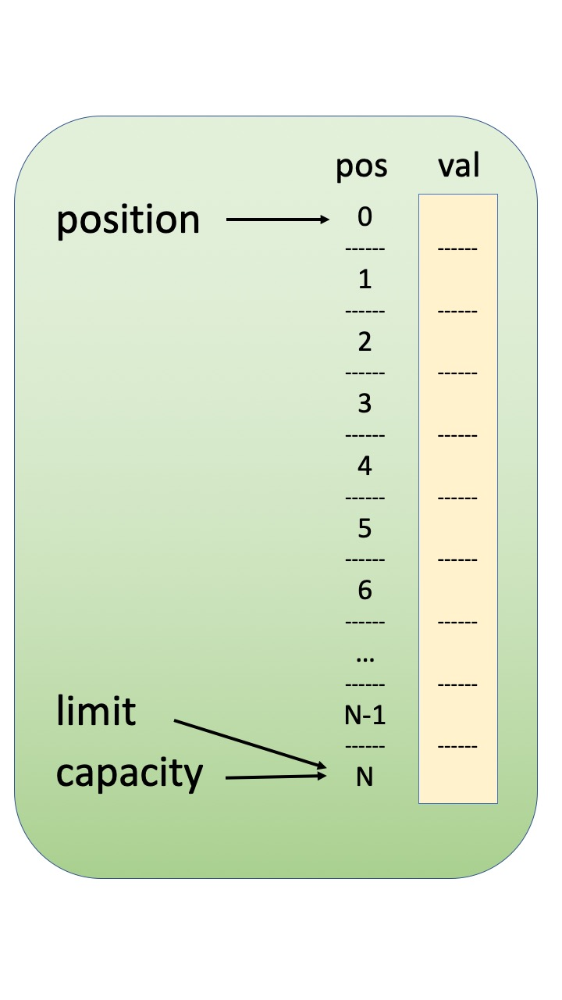
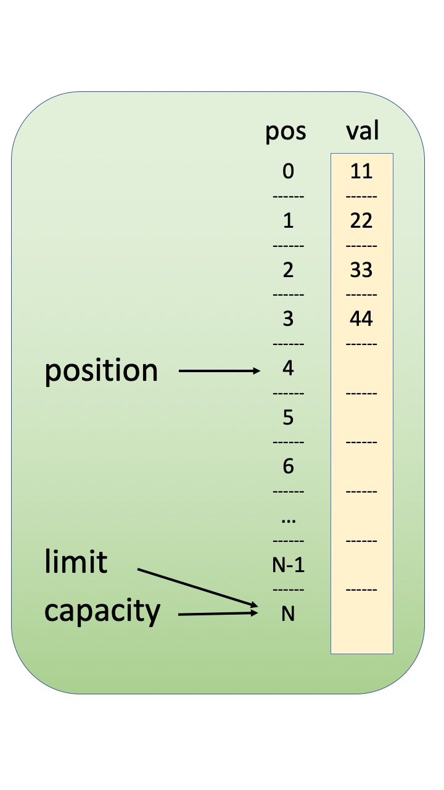
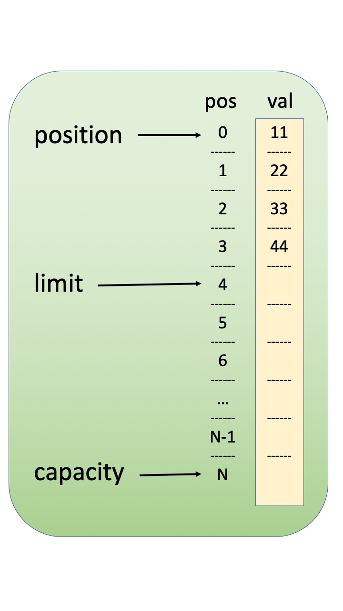
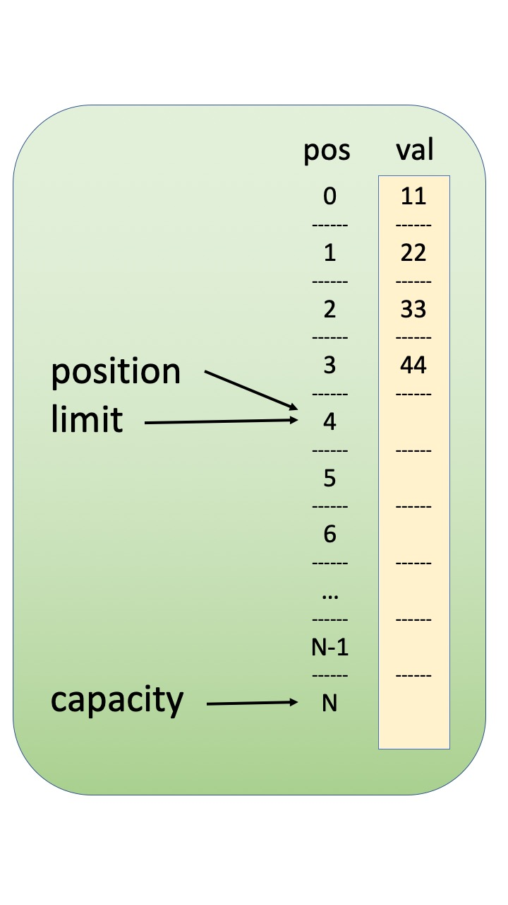

=====================
EVIO 6.0 User’s Guide
=====================

   Carl Timmer

   Jefferson Lab Experimental Physics Software
   and Computing Infrastructure group

   30-Sep-2020

    Thomas Jefferson National Accelerator Facility

   12000 Jefferson Ave

   Newport News, VA 23606

   Phone 757.269.7100

Chapter 1

Introduction To Evio Versions
=============================

Version 1
---------

Version 1 of the CODA EVIO package, written in C, was in use at
Jefferson Lab for over a decade. It has seen extensive use in Halls A
and C, where the raw data is written to disk in EVIO format, and has
seen limited use in the Hall B, where PRIMEX and the GlueX BCAL test
stored their raw data in EVIO format (CLAS stored raw data in BOS/FPACK
format).

Versions 2 & 3
--------------

In EVIO format versions 2 and 3 (no difference between them), the JLab
DAQ group upgraded and extended the EVIO package to meet some additional
needs. First added were XML conversion and other utilities, support for
all 1, 2, 4, and 8-byte data types, addition of a new TAGSEGMENT bank
type, support for gzipped files and pipes (courtesy of Steve Wood),
elimination of obsolete data types, as well as a number of bug fixes and
performance enhancements.

With the advent of object-orientation and C++ the DAQ group achieved a
major upgrade to the EVIO package beyond simple wrapping of existing C
code in C++. Since an EVIO event maps to a directed acyclic graph or
tree, a fact which allowed us to write the XML conversion utilities, we
based the object-oriented extension on the XML notion of stream and
Document Object Model (DOM) parsing and DOM trees. Note that banks in an
EVIO event can either be container nodes or leaf nodes, i.e. they can
contain either other banks **or** data, but not both (unlike XML, where
a node can contain both data AND other nodes).

The object-oriented extension to EVIO described below builds upon the
modern C++ standard, and makes liberal use of templates and the Standard
Template Library (STL) (i.e. containers, iterators, algorithms, function
objects, function object adaptors, smart pointers, etc). Fortunately
users need only be familiar with a small subset of these, and examples
in the tutorial below show how to do the most common tasks. However,
advanced users of the EVIO package should be able to take full advantage
of the STL.

Note that the object-oriented features build upon the existing C
library, and except as noted the C library continues to work as before.
On the Java front, the DAQ group adopted, extended, and supports Dave
Heddle's jevio package.

Version 4
---------

EVIO version 4 which can be found at
`http://coda.jlab.org <ftp://ftp.jlab.org/pub/coda/evio/2.0>`__ . The
following outlines the major changes that were made.

File Format Block Size
~~~~~~~~~~~~~~~~~~~~~~

In previous versions, the EVIO file format had fixed-size blocks
generally set to 8192 32-bit ints (32768 bytes) including a block
header. EVIO banks were often split across one or more blocks. This was
largely done for error recovery when using tape storage.

In version 4, since tape storage considerations are now irrelevant, each
block contains an integral number of events. Users can set the nominal
block size or events/block. Writing will not exceed the given limit on
events/block, but each block may contain significantly less events
depending on their size. The nominal block size will be exceeded in the
case that a single event larger than that size is written.

Network Communication Format
~~~~~~~~~~~~~~~~~~~~~~~~~~~~

In order to unify file and network communications, the new file format
is used for both. The C library has evOpenBuffer and evOpenSocket
routines to complement the traditional evOpen and allows reading and
writing with buffers and TCP sockets.

Expanded User Interface
~~~~~~~~~~~~~~~~~~~~~~~

The C library contains several new read routines which differ in their
memory handling. Options for the routine evIoctl have been expanded.
Routines for dictionary handling and other purposes have been added as
well.

Dictionary
~~~~~~~~~~

An xml format dictionary can be seamlessly included as the first bank of
a file/network format.

Padding
~~~~~~~

When using 1 and 2 byte data sizes (short, unsigned short, char, and
unsigned char) in previous EVIO versions, there was some ambiguity.
Because EVIO format dictates each bank, segment, or tagsegment must be
an integral number of 32-bit ints in length, specifying an odd number of
shorts or non-multiple of 4 number of chars meant there were extra,
unused shorts or chars that the user had to keep track of externally.

In version 4, with banks and segments (**not** tagsegments), these
unused shorts/chars or padding are tracked in the header by using the 2
highest bits of the content type. Padding can be 0 or 2 bytes for shorts
and 0-3 bytes for chars. All padding operations are completely
transparent to the user.

Data Formats
~~~~~~~~~~~~

There is a new data format called composite data which is used by Hall
B. In a nutshell it consists of a string which describes the format of
the data - allowing data of mixed types to be stored together - and is
followed by the data itself.

Random Access
~~~~~~~~~~~~~

There is a read routine which will read a particular event (say #347)
directly instead of having to read the previous (346) events.

Append Mode
~~~~~~~~~~~

There is now a writing mode which will append data to the end of an
existing file or buffer.

Splitting Files
~~~~~~~~~~~~~~~

The C, C++, and Java evio libraries all implement a means to limit the
size of an evio file being written by splitting it into multiple files.
There are facilities to make the automatic naming of these files simple.

Thread Safety
~~~~~~~~~~~~~

The libraries are now designed to be thread safe.

Graphics
~~~~~~~~

The Java library has a graphical user interface for viewing evio format
files.

1. 

Version 6
---------

EVIO version 6 can be found at
`http://coda.jlab.org <ftp://ftp.jlab.org/pub/coda/evio/2.0>`__ . The
following outlines the major changes that were made. A big factor for
introducing another evio version was the desire to compress data in each
block (now called a record). The HIPO format, in use in Jefferson Lab’s
HallB, was merged with evio along with much of the code to do
(un)compression of data. This has added a great deal of complexity to
the record headers (which are not compressed).

New Block or Record Format
~~~~~~~~~~~~~~~~~~~~~~~~~~

Version 6 has an expanded record header which allows for bookkeeping
associated with compression. It also allows for a user-defined portion
of the header along with an index of the position of each contained
event.

Compressed Data
~~~~~~~~~~~~~~~

Each record can contain data compressed in gzip, lz4 or lz4_best format.

Data Format Agnostic API
~~~~~~~~~~~~~~~~~~~~~~~~

The HIPO classes which were incorporated into evio are data format
agnostic. Thus, part of the evio library can now deal with data not in
evio format.

New C++ library
~~~~~~~~~~~~~~~

The C++ library in this version was ported from Java. From a
programmer’s point of view, this allows for simpler code maintenance.
The C++ library of the previous version is no longer available. There is
no independent C library either. All C library functions of the previous
version are available in the new C++ library.

Chapter 2

Basics of the C Library
=======================

There is no C Evio library per se. But using the C++ library, all the C
library calls of earlier versions can still be made. When using these
methods, it is entirely up to the user to provide buffers of data in the
exact evio format required. Thus, it requires a great deal of expert
knowledge. What may help is that the Evio file format is described in
Appendix A while bank structures and content type are described in
Appendix B. Appendix C explains the dictionary format.

Starting to use Evio
--------------------

The first thing a user must do is to "open" evio and obtain a handle to
be used as an argument for all other evio functions. There are now 3
possibilities in the 3 open routines:

1) **int evOpen(char \*filename, char \*flags, int \*handle)**

2) **int evOpenBuffer(char \*buffer, int bufLen, char \*flags, int
   \*handle)**

3) **int evOpenSocket(int sockFd, char \*flags, int \*handle)**

The first routine is for opening a file. The "flags" argument can "w"
for writing, "r" for reading, "a" for appending, "ra" for random access,
or “s” for splitting the file while writing. The splitting, appending
and random access modes are new in this version of evio and are not
backwards compatible. Writing a file will overwrite any existing data,
while appending will add new events to the end of a file. Reading a file
will allow access to each event in the order in which it exists in the
file - in other words, it is a sequential access to the events. The
random access mode, on the other hand, does a preliminary scan of the
file and allows reading (not writing) of selected events no matter where
they are in sequence. When writing large amounts of data it is often
convenient to split the output into a number of files. This is supported
by specifying the “s” flag. By proper specification of the filename
argument and by using the evIoctl() function, these split files can be
automatically named.

The second routine is for opening a buffer. It takes a pointer to a
buffer as well as its length in words (32 bit ints) as the first 2
arguments. The "flags" argument is the same as for evOpen() as discussed
in the previous paragraph with the exception of “s” since splitting
makes no sense for buffers.

The third is for opening evio with a TCP socket. The first argument is
the socket file descriptor of a TCP socket which was created elsewhere.
The "flags" argument in this case can only be "w" for writing, "r" for
reading since splitting, appending or random access makes no sense when
talking about a stream-oriented medium.

Reading events
--------------

There are now 4 routines able to read an event.

1) **int evRead(int handle, uint32_t \*buffer, size_t buflen)**

2) **int evReadAlloc(int handle, uint32_t \**buffer, uint64_t
   \*buflen)**

3) **int evReadNoCopy(int handle, const uint32_t \**buffer, uint64_t
   \*buflen)**

4) **int evReadRandom(int handle, const uint32_t \**pEvent, size_t
   eventNumber)**

The first is the original read routine which reads an event into a
user-given buffer. Its main problem is that the caller does not
generally know the size of the event before reading it and therefore the
supplied buffer may be too small - resulting in an error.

The second reads an event, allocating all the memory necessary to hold
it with the caller responsible for freeing that memory.

The way evio works internally is that a file/buffer/socket is read one
block at a time into an internal buffer. The third routine simply
returns a pointer to the next event residing in the internal buffer - so
no memory allocation or copying is done. If the data needs to be
swapped, it is swapped in place. Any other calls to read routines will
cause the data to be overwritten if a new block needs to be read in. Of
course, no writing to the returned pointer is allowed.

Finally, the last read routine works like the 3rd read routine described
in the previous paragraph in which a pointer to an internal buffer is
returned to the caller. It is valid only when evio has been opened in
random access mode and allows the caller to read only the event of
interest instead of all previous events as well.

Writing events
--------------

As in previous versions there is only 1 write routine simply because the
C library will only write in the new format, so no changes here:

   **int evWrite(int handle, const uint32_t \*buffer)**

However, there is a complication when writing to a buffer that does not
occur when writing to a file or socket. Unlike a file which grows as one
writes or a socket that will take any amount of data, the buffer that
the caller provides to contain what is written, is of fixed size. Thus
an error can be returned if the amount of data written exceeds the
buffer size; therefore, it is convenient to keep track of how much has
already been written, before continuing to write more. This can be done
through the following new routine:

   **int evGetBufferLength(int handle, uint64_t \*length)**

This routine returns the number of bytes currently written into a buffer
when given a handle provided by calling evOpenBuffer(). After the handle
is closed, this no longer returns anything valid.

.. _splitting-files-1:

Splitting files
~~~~~~~~~~~~~~~

When writing significant amounts of data to a single file, that file can
get very large – too large. Historically, run control was able to split
the data into multiple files with an automatic file naming system. For
this version of evio, the ability to split files is built in as is the
naming system. Start by setting the “flags” parameter in the evOpen()
call to “s”. In addition to that, the user may choose the number of
bytes at which to start writing to a new file by a call to evIoctl()
(see below). If not explicitly set, the split occurs at 1GB. If a
dictionary is defined by calling evWriteDictionary() (see below), then
that dictionary is included in each of the split files. The split files
are named according to the automatic naming system whose details are
given in the next section.

Naming files
~~~~~~~~~~~~

When splitting files, a base filename is passed to evOpen() and may
contain characters of the form **$(env)** where “env” is the name of an
environmental variable. When a file is created, all such contructs will
be substituted with the actual environmental variable’s value (or
nothing if it doesn’t exist).

Similarly, the base filename may contain constructs of the form **%s**
which will be substituted with the actual run type’s value (if set with
evIoctl) or nothing if run type is null or was not set.

Generated files names are distinguished by a split number which starts
with 0 for the first file and is incrementing by 1 for each additional
file. Up to 2, C-style integer format specifiers (such as %03d, or %x)
are allowed in the base filename. If more than 2 are found, an error is
returned. If no "0" precedes any integer between the "%" and the "d" or
"x" of the format specifier, it will be added automatically in order to
avoid spaces in the generated filename. The first specifier will be
substituted with the given run number value (set in evIoctl()). The
second will be substituted with the split number. If no specifier for
the split number exists, it is tacked onto the end of the file name.

Below is an example of how the file naming and splitting is done. Given
the list of values below

int split = 100000000; // split at 100MB

int runNumber = 1;

char \*runType = “myExperiment”;

char \*directory = “/myDirectory”;

char \*baseFilename = “my$(BASE_NAME)_%s_%x_%03d.ext”;

and a BASE_NAME environmental variable of the value “File”, the
following happens. The baseFilename string will have the environmental
variable, BASE_NAME, substituted in the obvious location along with the
runType substituted for the %s, the runNumber substituted for the %x
(hex format), and the split number substituted for the %03d. The first 3
split files will have the names:

myFile_myExperiment_1_001.ext

myFile_myExperiment_1_002.ext

myFile_myExperiment_1_003.ext

Controlling I/O through evIoctl()
---------------------------------

Some control over evio settings is given to the user with the evIoctl()
routine, shown below,

   **int evIoctl (int handle, char \*request, void \*argp)**

It can be used, for example, to set the target block size and the
maximum number of events/block for writes. It can also read various
quantities including the total number of events in a file or buffer
opened for reading or writing.

This routine can obtain a pointer to allocated memory containing the
most recently read block header. The size of the memory is 8, 32-bit
unsigned integers (words) and the pointer to the memory is obtained by
passing its address in argp. This pointer must be freed by the caller to
avoid a memory leak.

To summarize, the **request** parameter can be the case independent
string value of:

1) "B"  for setting target block size in words

2) “W” for setting writing (to file) internal buffer size in words

3) "N"  for setting max # of events/block

4) “R” for setting run number (used in file splitting)

5) “T” for setting run type (used in file splitting)

6) “S” for setting file split size in bytes

7) "V"  for getting evio version #

8) "H"  for getting 8 words of block header info

9) "E"  for getting # of events in file/buffer

The **argp** parameter is a:

1) pointer to 32 bit unsigned int containing block size in 32-bit words
   if request = B

2) pointer to 32 bit unsigned int containing buffer size in 32-bit words
   if request = W

3) pointer to 32 bit unsigned int containing max # of events/block if
   request = N

4) pointer to 32 bit unsigned int containing run # if request = R

5) pointer to character containing run type if request = T

6) pointer to 64 bit unsigned int containing file split size in bytes if
   request = S

7) pointer to 32 bit int returning the version # if request = V

8) address of pointer to unsigned 32 bit int returning a pointer to 8
   uint32_t's of block header if request = H. (This pointer must be
   freed by caller since it points to allocated memory).

9) | pointer to unsigned 32 bit int returning the total # of original
     events in existing
   | file/buffer when reading or appending if request = E

String manipulation
-------------------

In order to facilitate the handling of strings, 2 routines are provided.
The first,

**int evBufToStrings(char \*buffer, int bufLen, char \***pStrArray, int
\*strCount),**

takes evio string format data and converts it into an array of strings.
The second,

**int evStringsToBuf(uint32_t \*buffer, int bufLen, char \**strings,**

**int stringCount, int \*dataLen),**

does the reverse and takes an array of strings and places them in evio
format into a buffer.

.. _network-communication-format-1:

Network Communication Format
----------------------------

In order to unify file and network communications, the new file format
is used for both. The C library has evOpenBuffer() and evOpenSocket()
routines to complement the traditional evOpen() and allows reading and
writing with buffers and TCP sockets.

.. _dictionary-1:

Dictionary
----------

An xml format dictionary can be seamlessly included as the first event
when writing events to a file, buffer, or network. Refer to Appendix C
for details on the format of a dictionary. To write a dictionary, simply
call the following routine

**int evWriteDictionary(int handle, char \*xmlDictionary)**

**before** writing any events and it will be seamlessly included as the
first event in the first block. If events have already been written, an
error will be returned. When reading events, simply call the following
routine to get the dictionary, as a string, if it was defined:

   **int evGetDictionary(int handle, char \**dictionary, int \*len)**

Note that if a file is being split, each file contains the dictionary.

First Event
-----------

Occasionally it is useful to have the same event appear in each split
file, for example including a config event in each file. Such an event
is called the first event since typically it is the first event after
the dictionary in each of the splits. To define such an event, call the
following routine:

**int evWriteFirstEvent(int handle, const uint32_t \*firstEvent)**

It’s wise to call this before other events are written to avoid it being
left out of one of the early splits.

.. _data-formats-1:

Data Formats
------------

There is a new data format called composite data which is used by Hall
B. In a nutshell, it consists of an evio format string which describes
the format of the data - allowing data of mixed types to be stored
together - and is followed by the data itself.

Documentation
-------------

Besides the document you are now reading, there are doxygen docs which
are essentially javadoc web pages for C/C++ code. To those unfamiliar
with doxygen, programmers include specially formatted comments in the
code itself which is extracted by the doxygen program and formed into
web pages for view with a web browser. The user must generate these web
pages by going to the top level of the evio distribution and typing
"scons doc". Then simply view the doc/doxygen/C[or CC]/html/index.html
file in a browser.

Chapter 3

C++ API Basics
==============

The current C++ Evio library is different from the previous version as
it has been ported from the Java code. This was done for a number of
reasons. First, a much more comprehensive C++ library was desired than
currently existed. Second, it had to be able to (un)compress the data.
Third it had to use a new format developed from a merging of java evio
version 4 and the java HIPO library. Finally, the author and maintainer
of the previous code was no longer working at Jefferson Lab. The
simplest solution was to port the well-tested Java code which avoided
having to redesign complex software from scratch.

C++ evio is supported on both the MacOS and Linux platforms.

Prerequisites
-------------

C++ evio depends upon the Disruptor-cpp software package available from
github at https://github.com/Abc-Arbitrage/Disruptor-cpp.git. In terms
of functionality, it is an ingenious, ultrafast ring buffer which was
initially developed in Java
(https://github.com/LMAX-Exchange/disruptor.git) and then ported to C++.
It’s extremely useful when splitting work among multiple threads and
then recombining it.

If using the Disruptor software directly downloaded from github, be
aware that the distribution of the Disruptor made available as part of
the evio distribution has had 2 classes added. Thus, one must add the
**SpinCountBackoffWaitStrategy.cpp** and
**SpinCountBackoffWaitStrategy.h** files to any distribution taken
directly from github.

\*********\* Follow all instructions for compiling it in its README.MD
file. Note that it requires GCC 5.0 / Clang 3.8 or newer. Its shared
library must be installed where evio can find it.

Building
--------

There are 2 different methods to build the evio C++ library and
executables. The first uses **scons**, a Python-based build software
package which is available at https://scons.org. The second uses cmake
and make.

Scons
~~~~~

To get a listing of all the local options available to the scons
command, run **scons -h** in the top-level directory to get this output:

-D                  build from subdirectory of package

local scons OPTIONS:

--dbg               compile with debug flag

--32bits            compile 32bit libs & executables on 64bit system

--prefix=<dir>      use base directory <dir> when doing install

--incdir=<dir>      copy header  files to directory <dir> when doing
install

--libdir=<dir>      copy library files to directory <dir> when doing
install

--bindir=<dir>      copy binary  files to directory <dir> when doing
install

install             install libs, headers, and binaries

install -c          uninstall libs, headers, and binaries

doc                 create javadoc (in ./doc)

undoc               remove javadoc (in ./doc)

tar                 create tar file (in ./tar)

Use scons -H for help about command-line options.

Although this is fairly self-explanatory, executing **scons install**
will compile and install all the code. All compiled code is placed in
the generated **build** directory.

Cmake / make
~~~~~~~~~~~~

\*******************************\*

.. _documentation-1:

Documentation
-------------

The documentation for this software has already been created and is
hosted on the readthedocs.org website at
https://evio.readthedocs.io/en/latest/ (which, perhaps, you are reading
right now). If one wishes to probe the depths of the complicated stream
of operations necessary to produce the final result, here is a quick
guide to the process.

Doxygen
~~~~~~~

All the code is supplied with doxygen style comments. One can access it
directly by calling **scons doc** in the top-level directory; and it
will list each publicly accessible class and method. The result can be
viewed by using your web browser to view the created
doc/doxygen/CC/html/index.html file. To regenerate this file, first call
**scons undoc**, then again, **scons doc**. The doxygen comments can be
viewed from the readthedocs site as well so explicity dealing with
doxygen is not necessary.

User’s Guide
~~~~~~~~~~~~

The user’s guide is written and stored as a word document in the
doc/users_guide directory. Of course, this can be viewed in Microsoft
Word; however, in order to transform this document into something that
can be hosted on the readthedocs website, it must first be transformed
into the reStructuredText (rst) format. This is done by using the
**pandoc** program available from https://pandoc.org. Follow
instructions from that website in order to install it. On the Mac it’s
as simple as:

brew install pandoc

The **brew** command is available from https://brew.sh and is a package
manager. Once installed, the following command will do the
transformation from word to rst:

pandoc evio_UsersGuide.docx –f docx –t rst –s –o evio_UsersGuide.rst

Sphinx and Breathe
~~~~~~~~~~~~~~~~~~

Sphinx is a Python software package which is designed to output
documentation in various formats from input in rst format. This is why
the user’s guide was transformed into rst format – so that sphinx could
work its magic on it. Sphinx can be installed with the command:

pip install sphinx

And the Breathe plugin for sphinx, used to incorporate doxygen comments
properly, can be installed by calling:

pip install breathe

However, as in the case with doxygen, dealing directly with sphinx and
breathe is unnecessary. The readthedocs site is already linked to evio’s
github location and can automatically generate docs using its own sphinx
and breathe.

Doing this by hand requires the following steps:

\**********************************\*

Basics
------

There are some things necessary to know before reading and writing evio
format files. To see the technical details, go to `Appendix
B <#evio-data-format>`__. However, this is **not** intended to be a full
evio format tutorial. First, let's look at the classes which form the
basis of evio.

Evio's container structures are called banks, segments, and tagsegments.
These entities are implemented with 4 different classes. The very top
level of an evio structure is always a bank and is called an event. This
is represented by the **EvioEvent** class which is just a special case
(subclass) of an **EvioBank** with a little extra data included. Banks
have 2 words (8 bytes) of header followed by data. The **EvioSegment**
and **EvioTagSegment** classes represent segments and tagsegments
respectively, each have 1 word of header, no num value and differing
amounts of tag and type data.

To access the information about an evio structure contained in its
header, call getHeader() with event, bank, segment, or tagsegment
objects. Using the returned **BaseStructureHeader** object, there are
methods available to get & set values for its contents including type,
tag, number, length, and padding.

Events of any complexity can be created using either the
**EventBuilder** or **CompactEventBuilder** classes. The writing of
events is done through **EventWriter**, and the reading of events
through **EvioReader** or **EvioCompactReader**.

Three interfaces
----------------

The Java implementation of the evio library was developed first and the
C++ was ported from that. Since Java has performance issues surrounding
the creation and tracking of objects, additional classes (a second Java
API) was developed to minimize object creation and thereby improve
performance. As a result, there are now 2 different APIs to use in
handling evio data. Each will be described in different sections.

There is also a third interface (also originally written in Java and
ported ot C++) which treats events as buffers with any type of data,
that is, it’s data format agnostic. This API reads, writes, compresses
and uncompresses data of any type. The other 2 API’s call this one for
all evio 6.0 operations. The reading of earlier formats is done with
other code. This API will be described in its own section as well.

Shared Pointers
---------------

Evio data is a represented by a tree structure. Each evio structure,
EvioEvent, EvioBank, EvioSegment, and EvioTagSegment, contains
references to both parent and children. In order to facilitate
implementation in a safe way, all these references are shared pointers.

ByteBuffer Class
----------------

The **ByteBuffer** class is a transplant from Java. It’s not a complete
port due entirely to the big differences between C++ and Java. However,
it is extremely useful, saves a lot of effort, automagically takes care
of endian issues, and it’s used in much of the API. Here’s a little
tutorial, but the reader can always read the volumes written on the Java
version of this class to get a complete handle on it.

Basic Usage
~~~~~~~~~~~

In C++, a ByteBuffer is an object which wraps an array of uint8_t type.
This object provides a set of methods that makes it easier to work with
the memory block. Using a ByteBuffer to write and read data typically
follows this little 4-step process:

1. Write data into the buffer

2. Call buffer.flip()

3. Read data out of the buffer

4. Call buffer.clear() or buffer.compact()

When you write data into a buffer, the buffer keeps track of how much
data you have written. Once you need to read the data, you can prepare
the buffer for this by using the flip() method. The buffer lets you read
all the data written into the buffer. Once done reading, you can clear
the buffer, to make it ready for writing again by calling clear() or
compact().

A buffer has four properties you should be familiar with how itvworks.
These are:

-  capacity

-  position

-  limit

-  mark

.. _section-1:

Capacity
~~~~~~~~

The maximum number of byte elements the buffer can hold. The capacity is
set when the buffer is created and can never be changed.

Position
~~~~~~~~

The index of the next element to be read or written.

When you write data into the ByteBuffer, you do so at a certain
position. Initially the position is 0. There are 2 types of writing: 1)
an absolute write which does not advance its position after the write,
and 2) a relative write which when a byte, long etc. has been written
into the ByteBuffer, the position is advanced to point to the next
position in the buffer to insert data into. Position can maximally
become capacity - 1.

When you read data from a Buffer you also do so from a certain position.
When you flip a ByteBuffer from writing to reading, it’s limit is set
the current position and the position is reset back to 0, thus preparing
it to be read. There are 2 types of reading: 1) an absolute read which
does NOT advance its position after the read and 2) a relative read
which does. In the relative case, as you read data from the ByteBuffer
the position is advanced to next position to read.

Limit
~~~~~

The first element of the buffer that should not be read or written. In
other words, the count of live elements in the buffer. The limit is less
than or equal to the capacity.

Mark
~~~~

A remembered position. Calling mark() sets mark = position. Calling
reset() sets position = mark. The mark is undefined until set.

Example Diagrams
~~~~~~~~~~~~~~~~

**Initial buffer state in which position = 0, limit = capacity = N.**

**Also the state after calling clear().**

**Buffer after relative write of 4-byte integer = 0x11223344 (big endian)**

**Buffer after flip()**

**Buffer after relative read of one 4-byte integer**

   

Creating a Buffer
~~~~~~~~~~~~~~~~~

When creating a ByteBuffer object you can specify the amount memory in
its buffer. If not specified it allocates 4096 bytes. Here is an example
showing the allocation of a ByteBuffer, with a capacity of 128kBytes:

ByteBuffer buf(128000);

Writing Data
~~~~~~~~~~~~

You can write data into a buffer via its put() methods. The put() method
is overloaded, allowing the writing of different types of data or an
array of bytes into the buffer. Here is an example showing how to do a
relative write which places the written value at the buffer’s current
position and afterwards advances the position by the size of the write
(4 bytes in this case):

int myInt = 123;

buffer.put(myInt);

Here’s an example of writing at a specified position after which the
position does not change:

size_t position = 1024;

int myInt = 123;

buffer.put(position, myInt);

The flip() method
~~~~~~~~~~~~~~~~~

The **flip** method prepares a ByteBuffer for reading after being
written to. It sets the position back to 0, and sets the limit to where
position just was. In other words, position now marks the reading
position, and limit marks how many bytes, chars etc. were written into
the buffer - the limit of how many bytes, chars etc. that can be read.

Reading Data
~~~~~~~~~~~~

You can read data from the buffer using one of the get() methods. The
get() method is overloaded, allowing you to read data in different ways.
Here is an example of a relative read at the current position which
afterwards advances the postion by the size of the read (8 bytes in this
case):

int64_t myLong = buf.getLong();

Here’s an example of an absolute read at a specified position after
which the position does not change:

size_t position = 1024;

double myDouble = buffer.getDouble(position);

Endianness
~~~~~~~~~~

The transparent handling of the data’s endianness (big or little) is a
feature of ByteBuffers which makes reading and writing much easier. The
endianness can be set by calling the order() method. This works with the
ByteOrder class in the following way:

buf.order(ByteOrder::ENDIAN_BIG);

This method directs each write to place the data into the ByteBuffer’s
internal array in the prescribed endian. It also directs each read to
retrieve that data properly. Thus, the endian value of a ByteBuffer can
be set once and all reads and writes will transparently do the right
thing. The default endian value of a ByteBuffer object is the endian
value of the local node.

The rewind() method
~~~~~~~~~~~~~~~~~~~

The **rewind()** method sets the position back to 0, so you can reread
all the data in the buffer. The limit remains unchanged, thus still
marking how many bytes that can be read from the buffer.

The clear() and compact() methods
~~~~~~~~~~~~~~~~~~~~~~~~~~~~~~~~~

Once done reading data, one can make the buffer ready for writing again
by calling either the **clear()** or **compact()** method. The clear()
method does not erase any data, it merely sets the ByteBuffer back to
its initial state (position = 0, limit = capacity).

The compact() method only clears the data which you have already read.
If there is still unread data in the buffer that needs to be read later,
but some writing needs to be done first, call compact() instead of
clear(). This will copy all unread data to the beginning of the buffer.
Then it sets position to right after the last unread element. The limit
is set to capacity, just as in clear(). Now the buffer is ready for
writing, but you will not overwrite the unread data.

The mark() and reset() methods
~~~~~~~~~~~~~~~~~~~~~~~~~~~~~~

You can mark a given position in a buffer by calling the **mark()**
method. You can then later reset the position back to the marked
position by calling the **reset()** method.

The array() method
~~~~~~~~~~~~~~~~~~

You can directly access the internal array that stores the data in a
ByteBuffer by calling lthe **array()** method. For those readers
familiar with it, all C++ ByteBuffers (unlike Java) are backed by
arrays.

Chapter 4

Evio-specific C++ APIs
======================

As mentioned in the `previous section <#three-interfaces>`__, there are
2 APIs which only deal with evio data. Where they differ is that one
uses the classes **EventBuilder** and **EvioReader** to build events and
read data, while the other uses **CompactEventBuilder** and
**EvioCompactReader**. So what are the differences?

When communicating EvioEvents objects over the network, each object (and
all of its contained objects in its tree structure) must be serialized
into an array or buffer of bytes when sending and must deserialize the
same bytes back into objects on the receiving end. This can lead to a
serious performance penalty, especially in the original Java. To avoid
having to serialize and deserialize continually, a new API was developed
to allow the handling of evio data in byte buffer form. For lack of a
better term, **compact** was the word chosen to describe it since all
evio data handled in this API are contained in ByteBuffer objects and
never expanded into EvioEvent objects.

Event Creating with EventBuilder
--------------------------------

The **EventBuilder** class constructs evio events. It takes care of all
the little details and requires only the initial calling of a
constructor and subsequent calling of the addChild() method to create an
evio event. The builder will check all arguments, the byte order of
added data, type mismatches between parent & child, and will set all
evio header lengths automatically.

The following code uses the EventBuilder to create an event (almost
always a bank of banks) with 3 children (a bank of banks, a bank of
segments, and a bank of tagsegments). Each of these children have
children of their own. It’s written out to a buffer. The code relies on
the EvioEvent/Bank/Segment/TagSegment classes to get, fill, and update
their internal data vectors:

::
 **// Data to write stored in these vectors**

 vector<uint8_t> byteVec;
 vector<uint32_t> intVec;
 vector<double> doubleVec;
 vector<string> stringsVec;

 **//-------------------------------------**
 **// Build event (bank of banks) with EventBuilder object**

 uint32_t tag = 1, num = 1;
 EventBuilder builder(tag, DataType::BANK, num);
 shared_ptr<EvioEvent> event = builder.getEvent();

 **//-------------------------------------**
 **// First child of event = bank of banks**
 auto bankBanks = EvioBank::getInstance(tag+1, DataType::BANK, num+1);
 **// Add this bank as child of event**
 builder.addChild(event, bankBanks);

 **// Create first (& only) child of bank of banks = bank of ints**
 auto bankInts = EvioBank::getInstance(tag+11, DataType::UINT32, num+11);

 **// Get its internal vector of int data**
 auto &iData = bankInts->getUIntData();

 **// Write our data into that vector**
 iData.insert(iData.begin(), intVec.begin(), intVec.end());

 **// Done writing so tell builder to update its internals for this bank**
 bankInts->updateUIntData();

 **// Add this bank as child of bankBanks**
 builder.addChild(bankBanks, bankInts);

 **//-------------------------------------**
 **// Second child of event = bank of segments**
 auto bankSegs = EvioBank::getInstance(tag+2, DataType::SEGMENT, num+2);
 builder.addChild(event, bankSegs);

 **// Create first child of bank of segments = segment of doubles**
 auto segDoubles = EvioSegment::getInstance(tag+22, DataType::DOUBLE64);
 auto &sdData = segDoubles->getDoubleData();
 sdData.insert(sdData.begin(), doubleVec.begin(), doubleVec.end());
 segDoubles->updateDoubleData();
 builder.addChild(bankSegs, segDoubles);

 **// Create second child of bank of segments = segment of bytes**
 auto segBytes = EvioSegment::getInstance(tag+23, DataType::CHAR8);
 auto &scData = segBytes->getCharData();
 scData.insert(scData.begin(), byteVec.begin(), byteVec.end());
 segBytes->updateCharData();
 builder.addChild(bankSegs, segBytes);

 **//-------------------------------------**
 **// Third child of event = bank of tagsegments**
 auto bankTsegs = EvioBank::getInstance(tag+3, DataType::TAGSEGMENT, num+3);
 builder.addChild(event, bankTsegs);

 **// Create first child of bank of tagsegments = tagsegment of strings**
 auto tsegStrings = EvioTagSegment::getInstance(tag+33, DataType::CHARSTAR8);
 auto &tstData = tsegStrings->getStringData();
 tstData.insert(tstData.begin(), stringsVec.begin(), stringsVec.end());
 tsegStrings->updateStringData();
 builder.addChild(bankTsegs, tsegStrings);

 **//-------------------------------------**
 **// Remove first segment (and all descendants) in bank of segments**
 builder.remove(segDoubles);

 **//-------------------------------------**
 **// Take event, write it into buffer, get buffer ready to read**
 shared_ptr<ByteBuffer> buffer;

 event->write(*(buffer.get()));
 buffer->flip();

In addition to the methods for creating and adding banks, segments and
tagsegments, there are methods to add all the various data types like
chars, shorts, ints, longs, doubles, floats, and strings. The only
tricky thing is handling Composite format data. Look at `Appendix
B <#b.3-composite-data-type>`__ to get more information on handling this
complicated format.

Another way of creating events avoids the use of the EventBuilder class
altogether. Call the insert() method of each structure to place it into
another structure as a child. This way of doing things requires the
event to call setAllHeaderLengths() at the end to make sure all the evio
headers in the event have the proper lengths set. The following
abbreviated code does what the previous example does:

**// Create an event**

| auto event = EvioEvent::getInstance(tag, DataType::BANK, nm);
| **//-------------------------------------
  // First child of event = bank of banks
  **\ auto bankBanks = EvioBank::getInstance(tag+1, DataType::BANK,
  num+1);
| event->insert(bankBanks, 0);
| **// Create first (& only) child of bank of banks = bank of ints**\ *
  *\ auto bankInts = EvioBank::getInstance(tag+11, DataType::UINT32,
  num+11);
| auto &iData = bankInts->getUIntData();
| iData.insert(iData.begin(), intVec.begin(), intVec.end());
| bankInts->updateUIntData();
| bankBanks->insert(bankInts, 0);
| **//-------------------------------------**

| **// Second child of event = bank of segments**\ *
  *\ auto bankSegs = EvioBank::getInstance(tag2, DataType::SEGMENT,
  num+2);
| event->insert(bankSegs, 1);
| **// Create first child of bank of segments = segment of bytes**\ *
  *\ auto segBytes = EvioSegment::getInstance(tag+22, DataType::CHAR8);
| auto &scData = segBytes->getCharData();
| scData.insert(scData.begin(), byteVec.begin(), byteVec.end());
| segBytes->updateCharData();
| bankSegs->insert(segBytes, 0);
| **//-------------------------------------**

| **// Third child of event = bank of tagsegments**\ *
  *\ auto bankTsegs = EvioBank::getInstance(tag+3, DataType::TAGSEGMENT,
  num+3);
| event->insert(bankTsegs, 2);

| **// Create first child of bank of tagsegments = segment of ints**\ *
  *\ auto tsegInts = EvioTagSegment::getInstance(tag+33,
  DataType::UINT32);
| auto &tiData = tsegInts->getUIntData();
| tiData.insert(tiData.begin(), intVec.begin(), intVec.end());
| tsegInts->updateUIntData();
| bankTsegs->insert(tsegInts, 0);
| **//-------------------------------------**

**// If doing things this way, be sure to set all the header lengths**

event->setAllHeaderLengths();

Writing
-------

Writing to file or buffer
~~~~~~~~~~~~~~~~~~~~~~~~~

Start writing an evio format file or buffer with an **EventWriter**
object. Simply pick among the various constructors for your medium of
choice. There are optional parameters which allow the user to chose
whether to append to or overwrite any previously existing data. The user
can also set the maximum record size and the maximum number of events
per record as well as specify a dictionary and data byte order among
other things. Refer to the doxygen documentation for all of the
possibilities.

Below is some example code with comments showing how the writing is
done. It shows how to write to both files and buffers as well as how to
define a dictionary and how to create evio data. If the reader is
unfamiliar with the `ByteBuffer <#bytebuffer-class>`__ class, take some
time to read up on it when using buffers. It will allow you to do many
things.

**// Append or overwrite**

bool append = false;

| **// File’s name**
| string filename = "./myData";

**// Byte order in which to write data**

| ByteOrder order = ByteOrder::ENDIAN_LOCAL;
|   

   **// Create an EventWriter object to write out events to file**

EventWriter writer(file, order, append);

   **// Create an event**\ `(see previous
section) <#event-creating-with-eventbuilder>`__

   EventBuilder builder(1, DataType::BANK, 1);

**// Add structures & data here …**

| **// Get reference to the event just created
  **   auto event = builder.getEvent();
|    **// Write event to file**
|    writer.writeEvent(event);

|    **// All done writing**
|    writer.close();

.. _naming-files-1:

Naming files
~~~~~~~~~~~~

The filename passed to any of the constructors may contain characters of
the form **$(env)** where “env” is the name of an environmental
variable. When the file is created, all such constructs will be
substituted with the actual environmental variable’s value (or nothing
if it doesn’t exist).

Similarly, the filename may contain constructs of the form **%s** which
will be substituted with the actual run type’s value (if passed in as a
parameter to the constructor).

The filename may also contain the run number value (if passed in as a
parameter to the constructor) and the split number (if splitting). This
is done by allowing up to 2, C-style integer format specifiers (such as
%03d, or %x) in the filename. If more than 2 are found, an exception
will be thrown. If no "0" precedes any integer between the "%" and the
"d" or "x" of the format specifier, it will be added automatically in
order to avoid spaces in the generated filename. The first occurrence
will be substituted with the given run number value. If the file is
being split, the second will be substituted with the split number. If 2
specifiers exist and the file is not being split, no substitutions are
made.

.. _splitting-files-2:

Splitting files
~~~~~~~~~~~~~~~

When writing significant amounts of data to a single file, that file can
get very large – too large. Historically, run control was able to split
the data into multiple files with an automatic file naming system. The
ability to split files is now built into evio as is the naming system.
Simply pick the constructor designed for file splitting with parameters
allowing the user to choose the number of bytes at which to start
writing to a new file and the name of the files to use. The constructor
of both the EventWriter and EvioCompactEventWriter (more on this in the
next chapter) classes have input parameters for a base filename, run
type, run number, and split size.

A description of the general file naming system is in the section above,
but when splitting into multiple files (split size > 0), the user should
also be aware that the generated files names are distinguished by a
split number. If the base filename contains C-style int format
specifiers, then the first occurrence will be substituted with the given
run number value. The second will be substituted with the split number.
If no specifier for the split number exists, it is tacked onto the end
of the file name.

Below is example code with comments showing how the file naming and
splitting is done.

int split = 100000000; **// split at 100MB**

int runNumber = 1;

string runType = “myExperiment”;

string directory = “/myDirectory”;

string baseFilename = “my$(BASE_NAME)_%s_%x_%03d.ext”;

| EventWriter writer(baseFilename, directory,
|                    runType, runNumber, split,

64000, 1000, 300000,

byteOrder, dictionary,

bitInfo, overWriteOK, append);

The baseFilename string will have the value of the environmental
variable BASE_NAME, substituted for the $(BASE_NAME) part of the string
along with the runType substituted for the %s, the runNumber substituted
for the %x (hex format), and the split number substituted for the %03d.
If BASE_NAME has the value “File”, then the first 3 split files will
have the names:

myFile_myExperiment_1_001.ext

myFile_myExperiment_1_002.ext

myFile_myExperiment_1_003.ext

Reading
-------

Start reading an evio format file or buffer with an **EvioReader**
object. Simply pick among the various constructors for your medium of
choice. There is an optional parameter allowing the user to make sure
the incoming block numbers are sequential. (Find out about block numbers
by reading through Appendix A which describes the evio file format).
There is also an optional parameter for choosing between sequential and
random-access methods for reading a file.

Looking "under the hood" for a moment, the preferred, random-access (and
default) method of reading a file is to use a memory-mapped ByteBuffer
to be able to address each byte. It is much faster than using streams to
read a file sequentially. However, using a memory-mapped file is not
always possible. There is a fundamental limitation built into the Java
JVM which only allows indexes of arrays to be ints (and not longs).
Since ints are signed 32 bit entities, and since a ByteBuffer object is
backed by an array in which each byte is addressable, the result is that
only files less than or equal to 2\ :sup:`31` - 1 (2.147G) bytes in size
can be mapped. Files larger than that are read sequentially using
streams. This version of jevio is the first to be able to read and write
large files. The option exists to also read smaller files in a
sequential manner but that would only slow things down. One possibly
confusing part of the jevio interface is that methods that are
random-access in nature are implemented using sequential reads for large
files. Thus, jevio allows for a random-access style of approach even
when the underlying reading mechanism is sequential. To implement this,
all files and buffers are initially scanned to find the positions of
each event. Note that this may take significant time for large files.

On this matter of random-access vs. sequentially oriented method calls,
these are the 2 independent means of retrieving events from a
file/buffer. The following are the random-access methods of the
EvioReader class:

getEvent(int i)

parseEvent(int i)

gotoEventNumber(int i)

and the sequential methods:

nextEvent()

parseNextEvent()

rewind()

When mixing calls of these two categories in one application, there is
no need to worry about one type interfering with the other. For example,
if an application does a series of parseNextEvent() calls to look at a
file, then doing a parseEvent(20) method call in the middle of the
series will **not** change the sequence of the events returned by
parseNextEvent().

Now for a word on performance. As previously mentioned, do not choose to
read sequentially when reading files < 2.1 GB in size. When reading
larger files, it is usually faster to use the sequential methods. The
reason for that is they read in whole blocks (not individual events) at
a time. If the file was written with block sizes substantially greater
in size than a single event (the default when using small events), then
it will be faster. The random-access methods will, on the other hand,
hop to the event of interest and only read in that single event.

It's easier to give an example of code used to read a file than to
explain things abstractly. Various lines show how to get and use a
dictionary, read events with the sequential or random-access methods,
get the total number of events, and get & print data. The code below
uses many of the available evio features for reading and will read the
file or buffer created in the previous section.

| // For READING a file or buffer
| public static void main(String args[]) {
| String fileName  = "/home/myAccount/myData";
| File fileIn = new File(fileName);

ByteBuffer myBuf = null;

// Do we read from file or buffer?

boolean useFile = true;

|    try {
|     EvioReader evioReader;
|        if (useFile) {
|            evioReader = new EvioReader(fileName);
|        }
|        else {
|            myBuf.flip();
|            evioReader = new EvioReader(myBuf);
|        }
|        // Get any existing dictionary
|        String xmlDictString = evioReader.getDictionaryXML();
|        EvioXMLDictionary dictionary = null;
|        if (xmlDictString == null) {
|            System.out.println("Ain't got no dictionary!");
|        }
|        else {
|            // Create dictionary object from xml string
|            dictionary = new EvioXMLDictionary(xmlDictString);
|            System.out.println("Dictionary:\n" +
  dictionary.toString());
|        }
|        // How many events in the file?
|        int evCount = evioReader.getEventCount();
|        System.out.println("Read file, got " + evCount + " events:\n");
|        // Use "random access" capability to look at last event (starts
  at 1)
|        EvioEvent ev = evioReader.parseEvent(evCount);
|        System.out.println("Last event = " + ev.toString());
|        // Print out any data in the last event.
|        // In the writing example, the data for this event was set to
|        // be little endian so we need to read it in that way too.
|        ev.setByteOrder(ByteOrder.LITTLE_ENDIAN);
|        int[] intData = ev.getIntData();
|        if (intData != null) {
|            for (int i=0; i < intData.length; i++) {
|                System.out.println("intData[" + i + "] = " +
  intData[i]);
|            }
|        }
|        // Use the dictionary
|        if (dictionary != null) {
|            String eventName = dictionary.getName(ev);
|            System.out.println("Name of last event = " + eventName);
|        }
|        // Use sequential access to events
|        while ( (ev = evioReader.parseNextEvent()) != null) {
|            System.out.println("Event = " + ev.toString());
|        }
|        // Go back to the beginning of file/buffer for sequential
  methods
|        evioReader.rewind();

|    }
|    catch (Exception e) { e.printStackTrace(); }
| }

Searching
---------

Most users are also interested in searching an event, a bank, a segment,
or a tagsegment for various things. To this end, jevio has a couple of
built in searches for ease of use. See the javadoc for the
**StructureFinder** class for details. Custom searches can be done by
creating filters conforming to the **IEvioFilter** interface. Simply
define an **accept()** method to determine which structures to add to a
returned list. Following is an example of code that uses both the built
in search for banks with particular tag/num values and also a simple,
user-defined search for finding **EvioSegment** type structures with odd
numbered tags.

// Take some event (not defined here)

EvioEvent event;

| // Search it for banks (not segs, tagsegs) with particular tag & num
  values
| int tag=1, num=1;
| List<BaseStructure> list = StructureFinder.getMatchingBanks(
|                               event, tag, num);
| if (list != null) {

| for (BaseStructure bs : list) {
| System.out.println("Evio structure named \\"" + dictionary.getName(bs)
  +

| "\" has tag=1 & num=1");
| }

| }
| // ------------------------------------------------------------------
| // Search for banks/segs/tagsegs with a custom search criteria
| // ------------------------------------------------------------------
| // Define a filter to select Segment structures with odd numbered
  tags.
| class myEvioFilter implements IEvioFilter {
| public boolean accept(StructureType type, IEvioStructure struct){
|     return (type == StructureType.SEGMENT &&
|                (struct.getHeader().getTag() % 2 == 1));
|    }
| };

| // Create the defined filter
| myEvioFilter filter = new myEvioFilter();

| // Use the filter to search "event"
| list = StructureFinder.getMatchingStructures(event, filter);
| if (list != null) {
| for (BaseStructure bs : list) {
|    System.out.println("Evio structure named " +

| dictionary.getName(bs) + " is Segment with odd tag");
|    }
| }

Note that any bank, segment, or tagsegment structure can call
getMatchingStructures() directly instead of through the StructureFinder
class.

Parsing
-------

Users have some options while parsing events. Listeners and filters may
be added to an EvioReader to be used while events are being parsed. The
previous section has a good example of how to create a filter. One such
filter can be set for a reader object allowing the user to weed out
events of no interest.

Jevio also has an **IEvioListener** interface that can be used to define
multiple listeners that operate during parsing in a SAX-like manner. For
each listener, simply define 3 methods to be run -- before an event is
parsed, just after a structure in the event (bank, segment, or
tagsegment) has been parsed, and after the entire event has been parsed.
Following is an example of code that uses both a listener and a filter.

// Read some evio format file

EvioReader evioReader = new EvioReader(fileName);

| // Get the parser which is contained in the reader
| EventParser parser = evioReader.getParser();

| // Define a listener to be used with an event parser
| IEvioListener listener = new IEvioListener() {

// Run this method after each bank/seg/tagseg has been parsed

public void gotStructure(BaseStructure topStructure,

| IEvioStructure structure) {
|     System.out.println("Parsed structure of type " +

| structure.getStructureType());
|    }
| // Run this method before the event is parsed

| public void startEventParse(BaseStructure structure) {
|     System.out.println("Starting event parse");
|    }

| // Run this method after the event has been parsed
| public void endEventParse(BaseStructure structure) {
| System.out.println("Ended event parse");
| }
| };

| // Add the listener to the parser
| parser.addEvioListener(listener);

| // Define a filter to select everything (not much of a filter!)
| class myEvioFilter implements IEvioFilter {
| public boolean accept(StructureType type, IEvioStructure struct){
|     return true;
|    }
| };

// Create the above-defined filter

myEvioFilter filter = new myEvioFilter();

// Add the filter to the parser

parser.setEvioFilter(filter);

| // Now parse some event
| EvioEvent ev = evioReader.parseEvent(1);

Transforming
------------

Occasionally there can arise problems with the "num" parameter defined
by a EvioBank header but not the header of the EvioSegment or
EvioTagsegment. The **StructureTransformer** class can be used to
transform objects between these 3 classes while taking care of the
troublesome num. For example:

// Take an existing EvioSegment

EvioSegment seg;

int num = 10;

// Turn that segment into a bank

EvioBank bank = StructureTransformer.transform(seg, num);

Dictionaries
------------

This section describes how dictionaries can be used (refer to Appendix C
for the format). In general it is easiest to have one global dictionary
defined when manipulating evio data. For jevio this can be set in the
singleton **NameProvider** class/object. To set this global dictionary
simply do something like:

| // Define xml dictionary String
| String xmlDictString =
|       "<xmlDict>\n" +

|       "  <dictEntry name=\"first bank\"  tag=\"1\"  num=\"1\"/>\n" +
|       "  <dictEntry name=\"second bank\"  tag=\"2\"  num=\"2\"/>\n" +
|       "</xmlDict>";

// Create a dictionary object from xml String

EvioXmlDictionary dict = new EvioXmlDictionary(xmlDictString);

// Make it the global dictionary

NameProvider.setProvider(dict);

Once the global dictionary is set, the question is, "how is it used"?
The section in this chapter for "Searching" uses the **StructureFinder**
class and that is the case here as well. This class uses the global
dictionary if defined, but another dictionary may be specified as an
argument to its methods. There three methods in this class that use the
dictionary as seen below:

// Take some event (not defined here)

EvioEvent event;

// Names to look for

String name = "dictionaryEntry";

String childName = "childEntry";

String parentName = "parentEntry";

| // Search for structures (banks, segs, tagsegs) with a particular name
| List<BaseStructure> list1 = StructureFinder.getMatchingStructures(
|                               event, name, dict);

| // Search for structures whose parent has a particular name
| List<BaseStructure> list2 = StructureFinder.getMatchingParent(
|                               event, parentName, dict);

| // Search for structures who have a child with a particular name
| List<BaseStructure> list3 = StructureFinder.getMatchingChild(
|                               event, childName, dict);

// Print out the list of structures

if (list2 != null) {

| for (BaseStructure bs : list2) {
| System.out.println("Structure named \\"" + dictionary.getName(bs) +

| "\" has a parent named " + parentName);
| }

}

In order to implement other types of searches, it would be relatively
simple to copy the code for any of the three methods and modify it to
suit.

When a file or buffer is read, it may have a dictionary in xml format
associated with it. That dictionary is accessible through the
**EvioReader.getDictionaryXML()** method. For convenience, the
**EvioEvent** class has a place to store and retrieve an xml dictionary
string by using its **setDictionaryXML()**, **getDictionaryXML()**, and
**hasDictionaryXML()** methods.

The dictionary can also be used directly as an object of the
**EvioXmlDictionary** class. Once an xml string is parsed into such an
object (by means if its constructor), there are methods to retrieve the
parsed information. These methods can obtain tag/num pairs associated
with a name and vice versa. They can also obtain data types, data
formats, and descriptive comments associated with either a name or
tag/num pair.

| // Define xml dictionary String
| String xmlDictString =
|  "<xmlDict>\n" +

 " <dictEntry name=\"me\" tag=\"10\" num=\"0\" type=\"composite\" />\n"
+

" <description format=\"2iN(FD)\" >\n" +

" Any comments can go right here!" +

| " </description>\n" +
|  "  </dictEntry>\n" +
|  "</xmlDict>";

// Create a dictionary object from xml String

EvioXmlDictionary dict = new EvioXmlDictionary(xmlDictString);

// Retrieve & print info from dictionary

| System.out.println("Getting stuff for name = \\"me\":");
| System.out.println("    tag         = " + dict.getTag("me"));
| System.out.println("    num         = " + dict.getNum("me"));
| System.out.println("    type        = " + dict.getType("me"));
| System.out.println("    format      = " + dict.getFormat("me"));
| System.out.println("    description = " + dict.getDescription("me"));
| System.out.println("Getting stuff for tag = 10, num = 0:");
| System.out.println("    type        = " + dict.getType(10,0));
| System.out.println("    name        = " + dict.getName(10,0));
| System.out.println("    format      = " + dict.getFormat(10,0));
| System.out.println("    description = " + dict.getDescription(10,0));

There are also a couple of ways in which to iterate through the entries
of a dictionary to see what it contains using the **dict.getMap()**
method.

Method 1:

Map<String, EvioDictionaryEntry> map = dict.getMap();

Set<String> keys = map.keySet();

for (String key : keys) {

System.out.println("key = " + key +

", tag = " + dict.getTag(key) +

", num = " + dict.getTag(key));

}

Method 2:

int i=0;

Map<String, EvioDictionaryEntry> map = dict.getMap();

Set<Map.Entry<String, EvioDictionaryEntry>> set = map.entrySet();

for (Map.Entry<String, EvioDictionaryEntry> entry : set) {

String entryName = entry.getKey();

EvioDictionaryEntry entryData = entry.getValue();

System.out.println("entry " + (++i) + ": name = " + entryName +

", tag = " + entryData.getTag() +

", num = " + entryData.getTag());

}

.. _first-event-1:

First Event
-----------

If the user wants the same (first) event in each split file, then simply
select the **EventWriter** constructor that has an argument for the
first event (for either file or buffer writing). An alternative method
is to call the EventWriter’s:

**setFirstEvent ( EvioBank firstEvent );**

method. If calling the method, make sure it’s called before any other
events are written in order to ensure that it is written to each of the
split files.

XML format events
-----------------

If the user wants to view an event in xml format, that is easily
possible:

EvioEvent ev;

boolean asHex = true;

String xml1 = ev.toXML();

String xml2 = ev.toXML(asHex);

It’s also possible to go in the other direction and parse a file of xml
events into EvioEvent objects. In this case, if there is more than one
event, the top-level xml element must be:

<evio-data>

If there is no dictionary, the events must be indicated by the xml
element:

<event>

otherwise it can be any valid xml element whose value exists in the
dictionary. Elements whose tag/num/type info is not in the xml may have
it supplied by a dictionary entry.

String xml;

List<EvioEvent> list;

list = Utilities.toEvents(xml);

int maxEvents = 20, skip = 1;

EvioXmlDictionary dictionary;

boolean debug = false;

list = Utilities.toEvents(xml, maxEvents, skip, dictionary, debug);

Section

4

Compact Java Evio
=================

When communicating EvioEvents (java objects) over the network, the user
must serialize such events and all its contained objects into an array
or buffer of bytes when sending and must deserialize the same bytes into
objects on the receiving end. This can lead to a serious performance
penalty. To avoid having to serialize and deserialize continually, a new
API was developed to allow the handling of evio data in byte buffer
form. For lack of a better term, **compact** was the word chosen to
describe it since all evio data handled in this API are contained in
ByteBuffer objects and never expanded into EvioEvent objects.

.. _basics-1:

Basics
------

There are 4 classes comprising all the functionality:
**EvioCompactReader**, **EvioCompactStructureHandler**,
**CompactEventBuilder**, and **EvioNode**. Starting with the simplest
(and given a buffer of evio data) the EvioNode class stores information
about a single evio structure (bank, segment, or tagsegment) in that
buffer, but does not contain information about its internal structure.
In other words, there is no expansion into a tree and its necessarily
accompanying deserialization. It stores all the header information along
with locations of the header and data in the buffer itself.

The EvioCompactReader (compact reader for short) plays a similar role as
the EvioReader in that it parses a buffer or file (not bigger than 2.1
GB) in evio format. Its constructor creates an EvioNode object for each
event and stores it in a list. Methods allow searching an event for
structures of a given tag & num pair or dictionary entry. Once an
EvioNode object is obtained from a search, its structure's data can be
retrieved. A user-created evio structure can be added as the last child
of any event by calling **EvioCompactReader.addStructure()**. Banks and
entire events can be removed by calling
**EvioCompactReader.removeEvent()** or **removeStructure()**. Perhaps
the most powerful feature of the compact reader is that the user can
obtain a ByteBuffer representing just a single structure - an event,
bank, segment, or tagsegment (no block headers / no full evio file
format). This allows for the extraction of bytes representing a single
structure to be sent over the network. In this way it almost acts as a
writer as well as being a reader.

Working hand-in-hand with the compact reader, the
EvioCompactStructureHandler (structure handler for short) can parse the
bytes representing a single structure previously produced by the compact
reader. Actually any EvioEvent, EvioBank, EvioSegment, or EvioTagSegment
object can produce a byte representation of itself by calling its
write() method which the structure handler can parse. The structure
handler has methods to search for structures of a given tag & num pair
or dictionary entry. Once an EvioNode object is obtained from a search,
its structure's data can be retrieved. User-created evio structures can
be added to the end of any structure (which contains structures, cannot
add bank to bank of ints for example). As in the compact reader, the
user can obtain a ByteBuffer representing just a single structure.

There is no special class for writing compact events, just use
EventWriter which can write events that are in ByteBuffer form. A simple
measurement shows that using compact classes to search a file for
structures of a given tag/num pair is about 9x faster than using
EvioReader.

Instead of using the **EventBuilder** class to create events, one can
use the **CompactEventBuilder** class to do it. The advantage is that
the CompactEventBuilder minimizes the creation of objects and constructs
an event directly in a ByteBuffer and takes care of all the little
details. Because the event is created in a single buffer, it must be
done sequentially creating each evio element in its proper order.

There are methods to create and add banks, segments and tagsegments as
containers as well as methods to add all the various data types like
chars, shorts, ints, longs, doubles, floats. One can even add EvioNode
objects. The only tricky thing is handling Composite format data. Look
at `Appendix B <#b.3-composite-data-type>`__ to get more information on
handling this format.

Example 1
---------

// ---------------------------------------------------

// Use CompactEventBuilder to create event

| // ---------------------------------------------------
| public static void main(String args[]) {
| try {

int tag=1, num=1;

// Create buffer to store event in

ByteBuffer buf = ByteBuffer.allocate(1024);

// Use the CompactEventBuilder to create event

   CompactEventBuilder builder = new CompactEventBuilder(buf);

   | // create bank of banks
   | builder.openBank(tag, num, DataType.BANK);
   | // create bank of segments
   | builder.openBank(tag+1, DataType.SEGMENT);
   | // create segment of 3 shorts
   | builder.openSegment(tag+2, DataType.SHORT16);
   | short[] sdata = new short[] {1,2,3};

   builder.addShortData(sdata);

// Finish things up

builder.closeAll();

// Get buffer in ready-to-read form

buf = builder.getBuffer();

// -----------------------------------------------

// Write event to file

// -----------------------------------------------

File file = new File(“/tmp/myFile”);

| EventWriter writer = new EventWriter(file);
| writer.writeEvent(buf);

writer.close();

// -----------------------------------------------

// Read event from file and printout

// -----------------------------------------------

EvioCompactReader reader = new EvioCompactReader(“/tmp/myFile”);

EvioNode node = reader.getScannedEvent(1);

String xml = Utilities.toXML(node);

System.out.println(“XML:\n” + xml);

}

| catch (EvioException e) {
| e.printStackTrace();
| }

}

Example 2
---------

// ---------------------------------------------------

// Read file, search for tag/num, print data, add bank

| // ---------------------------------------------------
| public static void main(String args[]) {
| try {
| // Read file /tmp/myFile with compact reader

EvioCompactReader reader = new EvioCompactReader("/tmp/myFile");

// -----------------------------------------------

// Search for structure and print its data

// -----------------------------------------------

| // Search first event for tag = 3, num = 4
| List<EvioNode> returnList = reader.searchEvent(1, 3, 4);
| if (returnList.size() < 1) {
| throw new Exception("Found nothing in search");
| }

// First structure found in event 1 with tag = 3, num = 4

EvioNode node = returnList.get(0);

| // Get data in structure
| ByteBuffer buf = reader.getData(node);

| // Type of data in structure
| DataType dType = node.getDataTypeObj();
| // Print data in structure
| if (dType == DataType.DOUBLE64) {
| System.out.println("Double data =");
| DoubleBuffer dbuf = buf.asDoubleBuffer();
| for (int i=0; i < dbuf.limit(); i++) {
| System.out.println(i + "   " + dbuf.get(i));
| }
| }

// -----------------------------------------------

// Add user bank to first event

// -----------------------------------------------

// Create a bank to add to end of event, tag = 5, num = 6

| EvioBank bank = new EvioBank(5, DataType.INT32, 6);
| int[] intData = new int[] {1,2,3};
| try {
| bank.appendIntData(intData);
| }
| catch (EvioException e) {}
| ByteBuffer bb = ByteBuffer.allocate(4*12);
| bank.write(bb);
| bb.flip();

| // Add bank to event 1
| reader.addStructure(1, bb);
| }
| catch (EvioException e) {
| e.printStackTrace();
| }
| }

Example 3
---------

// ---------------------------------------------------

// Read file, remove first event.

// Get new first event (previously 2\ :sup:`nd`), remove structure,

// write to file

| // ---------------------------------------------------
| public static void main(String args[]) {
| try {
| // Read file /tmp/myFile with compact reader

EvioCompactReader reader = new EvioCompactReader("/tmp/myFile");

// Remove first event

if (reader.getEventCount() < 2) {

return;

}

reader.removeEvent(1);

// Get new first event (previously second)

EvioNode node = reader.getScannedEvent(1);

// Remove first child of event

ByteBuffer newBuffer = reader.removeStructure(node.getChildAt(0));

// Write to file

reader.toFile(“/tmp/filename”);

| }
| catch (EvioException e) {
| e.printStackTrace();
| }
| }

Example 4
---------

// ---------------------------------------------------

// Read file, get events, obtain their buffers,

// and write them to another file.

| // ---------------------------------------------------
| public static void main(String args[]) {
| try {
| // Read file /tmp/myFile with compact reader

EvioCompactReader reader = new EvioCompactReader("/tmp/myFile");

// Number of events in file

int evCount = reader.getEventCount();

// Create writer to file /home/user/outputFile

int runNumber = 1, split = 0, internalBufSize = 1000000;

String dictionary = null;

| EvioCompactEventWriter compactWriter =
| new EvioCompactEventWriter("outputFile", "/home/user",

| runNumber, split, internalBufSize,
|                                    ByteOrder.BIG_ENDIAN, dictionary);

| // Loop over all events
| for (int i=0; i < evCount; i++) {

// Read event #i from input file

ByteBuffer evBuf = reader.getEventBuffer(i);

| // Write event to output file
| compactWriter.writeEvent(evBuf);

}

// Flush internal buffer to file & close

compactWriter.close();

| }
| catch (EvioException e) {
| e.printStackTrace();
| }
| }

.. _xml-format-events-1:

XML format events
-----------------

If the user wants to view an event or any evio structure in xml format,
that is easily possible.

EvioNode node;

boolean asHex = true;

String xml = Utilities.toXML(node, asHex);

Section

5

 Utilities
=========

The utilities described below can be used to convert from binary EVIO to
ASCII XML format and back, and to selectively copy EVIO events from one
binary file to another. Below the term “event tag” refers to the tag of
the outermost bank in an event, which is always of type BANK (two-word
header, includes num).

evio2xml
--------

evio2xml, part of the C library, is a flexible utility that reads a
binary EVIO file and dumps selected events in XML format to stdout or to
a file:

$ evio2xml –h

evio2xml [-max max_event] [-pause] [-skip skip_event]

[-dict dictfilename] [-dtag dtag]

[-ev evtag] [-noev evtag] [-frag frag] [-nofrag frag]

[-max_depth max_depth]

[-n8 n8] [-n16 n16] [-n32 n32] [-n64 n64]

[-verbose] [-brief] [-no_data] [-xtod] [-m main_tag]

[-e event_tag]

[-indent indent_size] [-no_typename] [-maxbuf maxbuf]

[-debug]

[-out outfilenema] [-gz] filenamee

where most options customize the look and feel of the XML output, and
defaults should be satisfactory. –max specifies the maximum number of
events to dump, –pause causes evio2xml to pause between events, -skip
causes it to skip events before starting to dump them. By default the
bank tags are printed as numbers. The user can specify ASCII strings to
be used instead in a tag dictionary (via –dict). Contact the DAQ group
to get an example dictionary file.

eviocopy
--------

eviocopy, part of the C library, copies selected events from a binary
EVIO file to another binary EVIO file.

$ eviocopy –h

eviocopy [-max max_event] [-skip skip_event] [-ev evtag]

[-noev evtag] [-nonum evnum] [-debug]

   input_filename output_filename

where –max specifies the maximum number of events to copy, -skip cause
eviocopy to skip events, -ev causes eviocopy to only copy events with
the specified event tag, and

-noev inhibits copying of events with the specified tag. –ev and –noev
can be specified multiple times on the command line.

evioCat
-------

evioCat, part of the C++ library, concatenates multiple EVIO binary
files into 1 file.

$ evioCat –h usage:

evioCat [-maxev maxEvent] [-maxevFile maxEventFile] [-debug]

-o outputFile file1 file2 file3 ...

where –maxev specifies the max number of events to add, -maxevFile is
the max number of files to add, -debug causes debugging output to
screen, -o specifies the output file name and the rest of the arguments
are the files containing evio events to concatenate.

Xml2evio
--------

Xml2evio, part of the Java library, takes a file containing an xml
representation of evio events and converts it into an evio format file
and/or displays it on screen.

$ Usage: java org.jlab.coda.jevio.apps.Xml2evio -x <xml file> -f <evio
file>

[-v] [-hex] [-d <dictionary file>]

[-max <count>] [-skip <count>]

-h help

-v verbose output

-x xml input file name

-f evio output file name

-d xml dictionary file name

-hex display ints in hex with verbose option

-max maximum number of events to convert to evio

-skip number of initial events to skip in xml file

This program takes evio events in an xml file and

converts it to a binary evio file

Section

6

 C++ Tutorial
============

Below are examples showing: how to read an event from a file into an
evioDOMTree; how to query the tree to get lists of node pointers that
satisfy various criteria and how to work with the lists; and how to
modify the tree. Some advanced topics follow.

Simple event I/O
----------------

Below is a simple example that uses an evioFileChannel object to open
and read an EVIO file, then create an evioDOMTree from the event in the
evioFileChannel object, then dump the event to stdout:

#include <evioUtil.hxx>

using namespace evio;

using namespace std;

int main(int argc, char \**argv) {

try {

// create evio file channel object for reading, argv[1] is filename

evioFileChannel chan(argv[1], “r”);

// open the file

chan.open();

// loop over events

while(chan.read()) {

// create tree from contents of file channel object

evioDOMTree tree(chan);

// print tree

cout << tree.toString() << endl;

}

// eof reached...close file

chan.close();

} catch (evioException e) {

cerr << endl << e.toString() << endl << endl;

exit(EXIT_FAILURE);

}

// done

exit(EXIT_SUCCESS);

}

The tree can be written to a file via the write() method of the
evioChannel class.

Querying the event tree
-----------------------

There are many ways to query an evioDOMTree to get lists of subsets of
nodes in the tree. To get an STL list of pointers to all nodes in the
tree:

evioDOMNodeListP pList = tree.getNodeList();

(Note to experts: evioDOMNodeListP is actually auto_ptr<
list<evioDOMNodeP> >, where evioDOMNodeP is evioDOMNode*)

Here no predicate is given to getNodeList() so all pointers are
returned. To get a list of pointers to just container nodes:

evioDOMNodeListP pContainerList = tree.getNodeList(isContainer());

where isContainer() is a function object provided with the EVIO package
(see Appendix D for a list of all supplied function objects). Similarly,
to get a list of just leaf nodes:

evioDOMNodeListP pLeafList = tree.getNodeList(isLeaf());

To get a list of pointers to nodes satisfying arbitrary user criteria:

evioDOMNodeListP pMyList = tree.getNodeList(myChooser);

where myChooser() is a simple C function instead of a function object.
An example that specifies particular tag/num combinations is:

bool myChooser(const evioDOMNodeP node) {

return(

((node->tag==3)&&(node->num==0)) \|\|

((node->tag==2)&&(node->num==1))

);

}

To print all the nodes in the list (there are many ways to do this):

for_each(pList->begin(), pList->end(), toCout());

for_each() is one of a large number of STL algorithms. It accepts an STL
iterator range (pList->begin(), pList->end()) and applies the function
object in its third argument to each object in the iterator range in
turn. Here toCout() is another of the many function objects supplied by
the EVIO package. toCout() invokes the toString() method of the objects
pointed to by the iterator, then streams the result to cout.

To print just leaf nodes, this time using iterators:

evioDOMNodeList::iterator iter;

for(iter=pLeafList->begin(); iter!=pLeafList->end(); iter++) {

cout << endl << (*iter)->toString() << endl;

}

Note that (*iter) is an evioDOMNodeP, i.e. a pointer to an evioDOMNode
object.

To count the number of leaf nodes with tags between 0 and 20 (this is an
inefficient algorithm shown for illustration only):

for(int tag=0; tag<=20; tag++) {

cout << "There are "

<< count_if(pLeafList->begin(), pLeafList->end(), tagEquals(tag))

<< " leaf nodes with tag " << tag << endl;

}

count_if() is another STL algorithm that counts all objects within the
iterator range for which the predicate in the third argument is true.
tagEquals() is another EVIO function object that returns true if the tag
of the object pointed to by the iterator is equal to the argument given
to the tagEquals() constructor, in this case the loop index “tag”.

To search the full list and print the data from all leaf nodes
containing floats (i.e. vector<float>) using the evioDOMNode member
function getVector():

evioDOMNodeList::iterator iter;

for(iter=pList->begin(); iter!=pList->end(); iter++) {

vector<float> \*v = (*iter)->getVector<float>();

if(v!=NULL) {

cout << endl << endl << “Float node data:" << endl;

for(int i=0; i<v->size(); i++) cout << (*v)[i] << endl;

}

}

Note that getVector<T>() returns NULL if the node is not a leaf node
containing (in this case) floats. You can tell what type of data is
contained in a node via the getContentType() member function. See
Appendix C for a list of legal content types.

To search the full list and access the child lists of container nodes
using getChildList():

evioDOMNodeList::iterator iter;

for(iter=pList->begin(); iter!=pList->end(); iter++) {

evioDOMNodeList \*pChildList = (*iter)->getChildList();

cout << “Node has “ << pChildList->size() << “ children” << endl;

if(pChildList->size()>0) {

evioDOMNodeList::const_iterator cIter;

for(cIter=pChildList->begin(); cIter!=pChildList->end(); cIter++) {

cout << "child has tag: " << (*cIter)->tag << endl;

}

}

}

Manipulation of the event tree
------------------------------

To add a new leaf node containing integers to the root node (must be
container) of a tree:

unsigned short tag;

unsigned char num;

vector<int> myIntVec(100,1);

tree.addBank(tag=5, num=10, myIntVec);

or:

tree << evioDOMNode::createEvioDOMNode(tag=5, num=10, myIntVec);

or:

tree.root->addNode(evioDOMNode::createEvioDOMNode(tag=5, num=10,
myIntVec));

If cn1 is a container node somewhere in the tree hierarchy you can add a
new node ln2 to cn1 (here ln2 is a leaf node containing ints) via:

evioDOMNodeP ln2 = evioDOMNOde::createEvioDOMNode(tag=2, num=8,
myIntVec);

cn1->addNode(ln2);

or:

\*cn1 << ln2;

To append more data to ln2:

vector<int> myIntVec2(100,2)

ln2->append(myIntVec2);

or:

\*ln2 << myIntVec2;

To replace the data in ln2 with new data:

ln2->replace(myIntVec2);

To move ln2 from cn1 to another container node cn3:

ln2->move(cn3);

To cut cn1 out of the tree:

cn1->cut(); // just cut it out

or:

cn1->cutAndDelete(); // also delete cn1 and all of its contents

Example programs
----------------

A number of annotated example programs exist in the examples directory
in the EVIO distribution. These demonstrate how to read and write files;
query and manipulate event trees; create, manipulate, modify, and delete
banks; etc.

Advanced topics
---------------

The following examples cover some more advanced features and topics that
can be ignored by most users:

evioDOMNodeListP is a smart pointer (auto_ptr<>) that is used to ensure
the memory used by the lists returned by getNodeList() is released when
the lists go out of scope. While in most respects smart pointers act
like normal pointers, they have some unusual assignment semantics. If
one smart pointer is set equal to another, ownership of the contents is
transferred, and the original loses ownership, e.g:

evioDOMNodeListP p1(...); // p1 points to something

evioDOMNodeLIstP p2(); // p2 empty

p2=p1; // p2 points to something, p1 is now empty!!!

Further, smart pointers must not be stored in STL containers. See the
STL documentation for more information on smart pointers and auto_ptr.

Note that if a standard shared pointer ever appears auto_ptr<> will be
replaced. We decided not to use the Boost shared pointer as Boost is not
part of the standard Linux distribution. We are considering
incorporating a third-party shared pointer into the EVIO library if
nothing else appears. Contact EJW for more information.

Section

8

Java Evio (Jevio)
=================

The current Java EVIO package (org.jlab.coda.jevio) was originally
written by Dr. Dave Heddle of CNU and was graciously given to the JLAB
DAQ group for maintenance and continued development. Since it was
created independently of the C++ implementation, it differs in its
interface but contains much of the same functionality.

.. _building-1:

Building
--------

The java evio uses **ant** to compile. To get a listing of all the
options available to the ant command, run **ant help** in the evio top
level directory to get this output:

| help:
|     [echo] Usage: ant [ant options] <target1> [target2 \| target3 \|
  ...]
|     [echo]        targets:
|     [echo]        help       - print out usage
|     [echo]        env        - print out build file variables' values
|     [echo]        compile    - compile java files
|     [echo]        clean      - remove class files
|     [echo]        cleanall   - remove all generated files
|     [echo]        jar        - compile and create jar file
| [echo] install - create jar file and install into 'prefix'

[echo] if given on command line by -Dprefix=dir',

[echo] else install into CODA if defined

[echo] uninstall - remove jar file previously installed into 'prefix'

[echo] if given on command line by -Dprefix=dir',

| [echo] else installed into CODA if defined
|     [echo]        all        - clean, compile and create jar file
|     [echo]        javadoc    - create javadoc documentation
|     [echo]        developdoc - create javadoc documentation for
  developer
| [echo] undoc - remove all javadoc documentation

    [echo]        prepare    - create necessary directories

Although this is fairly self-explanatory, executing **ant** is the same
as **ant compile**. That will compile all the java. All compiled code is
placed in the generated **./build** directory. If the user wants a jar
file, execute **ant jar** to place the resulting file in the
**./build/lib** directory.

.. _documentation-2:

Documentation
-------------

In addition to the documentation in this file, there is javadoc which
can be generated from the full source distribution of evio. While not as
detailed in explanation as this chapter, it will be much more complete
with each publicly accessible class and method being listed. Javadoc can
be generated by going into the top level evio directory and executing
the command **ant javadoc**. If more detail is desired, classes and
methods which are not public can be seen by creating the javadoc by
executing the command **ant developdoc**. This is more suitable for a
developer. The resulting javadoc is placed in the **./doc/javadoc**
directory. Look in that directory at the file named **index.html** in a
browser.

.. _basics-2:

Basics
------

There are some things necessary to know before reading and writing evio
format files. However, this is **not** intended to be a full evio
tutorial. First, let's look at the classes which form the basis of evio
data and do some basic manipulations.

Evio's container structures are banks, segments, and tagsegments. These
entities are implemented with 4 different classes. At the very top level
is the **EvioEvent** which is just a special case (subclass) of an
**EvioBank** with dictionary and other extra data included. Banks, of
course, have 2 words (8 bytes) of header followed by data. The
**EvioSegment** and **EvioTagSegment** classes represent segments and
tagsegments respectively, each have 1 word of header, no num value and
differing amounts of tag and type data.

To get information contained in a header, call getHeader() with event,
bank, seg, or tagseg objects. Using the returned **BaseStructureHeader**
object, there are methods available to get & set values for content
type, tag, num, length, and padding.

Events of any complexity (containing container structures) are created
using the **EventBuilder** class. The writing of events is done through
**EventWriter** objects, and the reading of events through
**EvioReader**. There is also a graphical viewer of events available in
**EventTreeFrame**.

In previous versions of evio, only files could be written and read.
Currently, however, evio data can be handled by buffers as well.

The next 2 sections have examples which work together. The reading
example will read what the writing example produces.

Event Creating
--------------

There are 2 ways to create an evio event. Start with the simplest first
-- use the **EventBuilder** class to do it. This takes care of all the
little details and requires only the initial calling of the constructor
and subsequent calling of the addChild() method to create an evio event.
The builder will check all arguments, the byte order of added data, type
mismatches between parent & child, and will set all evio header lengths
automatically. The following code uses the EventBuilder to create an
event (bank) of banks with 1 child which is a bank of segments. The bank
of segments also has 1 child which is a segment of shorts.

// Use the EventBuilder class to create event of banks, tag=1, num=1

| EventBuilder builder = new EventBuilder(1, DataType.BANK, 1);
| EvioEvent event = builder.getEvent();
| // bank of segments
| EvioBank bankSegs = new EvioBank(2, DataType.SEGMENT, 2);
| builder.addChild(event, bankSegs);
| // segment of 3 shorts
| EvioSegment segShorts = new EvioSegment(3, DataType.SHORT16);
| short[] sdata = new short[] {1,2,3};

| segShorts.setShortData(sdata);
| builder.addChild(bankSegs, segShorts);

// To remove a structure

builder.remove(segShorts);

There are methods to create and add banks, segments and tagsegments as
containers as well as methods to add all the various data types like
chars, shorts, ints, longs, doubles, floats and their arrays. The only
tricky thing is handling Composite format data. Look at `Appendix
B <#b.3-composite-data-type>`__ to get more information on handling this
format.

The second means is to call the insert() method of the event or its
children. This method requires the event to call setAllHeaderLengths()
at the end to make sure all the evio headers in the event have the
proper lengths set. The following code does exactly what the previous
example does but does not check for the issues mentioned above:

| // Use event constructor and insert() calls
| EvioEvent event = new EvioEvent(1, DataType.BANK, 1);
| // bank of segments
| EvioBank bankSegs = new EvioBank(2, DataType.SEGMENT, 2);
| event.insert(bankSegs);
| // segment of 3 shorts
| EvioSegment segShorts = new EvioSegment(3, DataType.SHORT16);
| short[] sdata = new short[] {1,2,3};

| segShorts.setShortData(sdata);
| bankSegs.insert(segShorts);

// To remove a structure

bankSegs.remove(segShorts);

// Make sure all evio headers have correct lengths

event.setAllHeaderLengths();

.. _writing-1:

Writing
-------

.. _writing-to-file-or-buffer-1:

Writing to file or buffer
~~~~~~~~~~~~~~~~~~~~~~~~~

Start writing an evio format file or buffer with an **EventWriter**
object. Simply pick among the various constructors for your medium of
choice. There are optional parameters including allowing the user to
chose whether to append to or overwrite any previously existing data.
The user can also set the block size and number of events per block as
well as specify a dictionary and data byte order among other things.
Refer to the javadoc for all of the possibilities.

Below is some example code with comments showing how the writing is
done. It shows how to write to both files and buffers as well as how to
define a dictionary and how to create evio data. If the reader is
unfamiliar with Java's **ByteBuffer** class, take some time to read up
on it when using buffers. It will allow you to do many things.

| // For WRITING a file or buffer
| public static void main(String args[]) {
|    // Define xml dictionary
|    String xmlDictionary =
|       "<xmlDict>\n" +
|       "  <bank name=\"bank of banks\"          tag=\"1\"  
  num=\"1\">\n" +
|       "     <bank name=\"bank of segments\"    tag=\"2\"  
  num=\"2\">\n" +
|       "       <leaf name=\"segment of shorts\" tag=\"3\"   />\n" +
|       "     </bank>\n" +
|       "     <bank name=\"bank of banks\"       tag=\"4\"  
  num=\"4\">\n" +
|       "       <leaf name=\"bank of chars\"     tag=\"5\"  
  num=\"5\"/>\n" +
|       "     </bank>\n" +
|       "  </bank>\n" +
|       "  <dictEntry name=\"last bank\"        tag=\"33\" 
  num=\"66\"/>\n" +
|       "</xmlDict>";

| // Data to write
| byte[]  byteData1 = new byte[]  {1,2,3,4,5};
| int[]   intData1  = new int[]   {4,5,6};
| int[]   intData2  = new int[]   {7,8,9};
| short[] shortData = new short[] {11,22,33};

// Do we append or overwrite?

boolean append = false;

// Do we write to file or buffer?

boolean toFile = true;

| ByteBuffer myBuf = null;
| try {

EventWriter writer;

if (toFile) { 

          // Create an event writer to write out the test events to file

| // along with a dictionary
| String fileName  = "./myData";
|     File file = new File(fileName);

| writer = new EventWriter(file, xmlDictionary, append);
| }

| else {
|           // Or create an event writer to write to buffer
|           myBuf = ByteBuffer.allocate(10000);
|           myBuf.order(ByteOrder.LITTLE_ENDIAN);
|           writer = new EventWriter(myBuf, xmlDictionary, append);
| }

|        // event - bank of banks
|        EventBuilder builder = new EventBuilder(1, DataType.BANK, 1);
|        EvioEvent event = builder.getEvent();
|        // bank of segments
|        EvioBank bankSegs = new EvioBank(2, DataType.SEGMENT, 2);
|        builder.addChild(event, bankSegs);
|        // segment of 3 shorts
|        EvioSegment segShorts = new EvioSegment(3, DataType.SHORT16);
|        segShorts.setShortData(shortData);
|        builder.addChild(bankSegs, segShorts);
|        // another bank of banks
|        EvioBank bankBanks = new EvioBank(4, DataType.BANK, 4);
|        builder.addChild(event, bankBanks);
|        // bank of chars
|        EvioBank charBank = new EvioBank(5, DataType.CHAR8, 5);
|        charBank.setByteData(byteData1);
|        builder.addChild(bankBanks, charBank);
|        // Write event to file
|        writer.writeEvent(event);

// How much room do I have left in the buffer now?

if (!toFile) {

System.out.println("I have " + myBuf.remaining() + " bytes left");

| }
|        // event - bank of ints
|        EvioEvent lastEvent = new EvioEvent(33, DataType.INT32, 66);

// Tell jevio what the data's endianness is.

// This will not swap anything now but will

// enable it to be written out properly.

// NOT necessary to call if data is big endian.

| // Call this BEFORE dealing with data!
|        lastEvent.setByteOrder(ByteOrder.LITTLE_ENDIAN);

| // Overwrite all previous data with "setIntData"
|        lastEvent.setIntData(intData1);

| // Append data to end with "appendIntData"
|        lastEvent.appendIntData(intData2);

|        // Write last event to file or buffer
|        writer.writeEvent(lastEvent);
|        // All done writing
|        writer.close();
|    }
|    catch (IOException e) {
|        e.printStackTrace();
|    }
|    catch (EvioException e) {
|        e.printStackTrace();
|    }

}

.. _naming-files-2:

Naming files
~~~~~~~~~~~~

The filename passed to any of the constructors may contain characters of
the form **$(env)** where “env” is the name of an environmental
variable. When the file is created, all such constructs will be
substituted with the actual environmental variable’s value (or nothing
if it doesn’t exist).

Similarly, the filename may contain constructs of the form **%s** which
will be substituted with the actual run type’s value (if passed in as a
parameter to the constructor).

The filename may also contain the run number value (if passed in as a
parameter to the constructor) and the split number (if splitting). This
is done by allowing up to 2, C-style integer format specifiers (such as
%03d, or %x) in the filename. If more than 2 are found, an exception
will be thrown. If no "0" precedes any integer between the "%" and the
"d" or "x" of the format specifier, it will be added automatically in
order to avoid spaces in the generated filename. The first occurrence
will be substituted with the given run number value. If the file is
being split, the second will be substituted with the split number. If 2
specifiers exist and the file is not being split, no substitutions are
made.

.. _splitting-files-3:

Splitting files
~~~~~~~~~~~~~~~

When writing significant amounts of data to a single file, that file can
get very large – too large. Historically, run control was able to split
the data into multiple files with an automatic file naming system. For
this version of evio, the ability to split files is built in as is the
naming system. Simply pick the constructor designed for file splitting
with parameters allowing the user to choose the number of bytes at which
to start writing to a new file and the name of the files to use. The
constructor of both the EventWriter and EvioCompactEventWriter (more on
this in the next chapter) classes have input parameters for a base
filename, run type, run number, and split size.

A description of the general file naming system is in the section above,
but when splitting into multiple files (split size > 0), the user should
also be aware that the generated files names are distinguished by a
split number. If the base filename contains C-style int format
specifiers, then the first occurrence will be substituted with the given
run number value. The second will be substituted with the split number.
If no specifier for the split number exists, it is tacked onto the end
of the file name.

Below is example code with comments showing how the file naming and
splitting is done.

int split = 100000000; // split at 100MB

int runNumber = 1;

String runType = “myExperiment”;

String directory = “/myDirectory”;

String baseFilename = “my$(BASE_NAME)_%s_%x_%03d.ext”;

| EventWriter writer = new EventWriter(baseFilename, directory,
|                        runType, runNumber, split,

64000, 1000, 300000,

byteOrder, dictionary,

bitInfo, overWriteOK, append);

The baseFilename string will have the environmental variable, BASE_NAME,
substituted in the obvious location along with the runType substituted
for the %s, the runNumber substituted for the %x (hex format), and the
split number substituted for the %03d. If BASE_NAME has the value
“File”, then the first 3 split files will have the names:

myFile_myExperiment_1_001.ext

myFile_myExperiment_1_002.ext

myFile_myExperiment_1_003.ext

.. _reading-1:

Reading
-------

Start reading an evio format file or buffer with an **EvioReader**
object. Simply pick among the various constructors for your medium of
choice. There is an optional parameter allowing the user to make sure
the incoming block numbers are sequential. (Find out about block numbers
by reading through Appendix A which describes the evio file format).
There is also an optional parameter for choosing between sequential and
random-access methods for reading a file.

Looking "under the hood" for a moment, the preferred, random-access (and
default) method of reading a file is to use a memory-mapped ByteBuffer
to be able to address each byte. It is much faster than using streams to
read a file sequentially. However, using a memory-mapped file is not
always possible. There is a fundamental limitation built into the Java
JVM which only allows indexes of arrays to be ints (and not longs).
Since ints are signed 32 bit entities, and since a ByteBuffer object is
backed by an array in which each byte is addressable, the result is that
only files less than or equal to 2\ :sup:`31` - 1 (2.147G) bytes in size
can be mapped. Files larger than that are read sequentially using
streams. This version of jevio is the first to be able to read and write
large files. The option exists to also read smaller files in a
sequential manner but that would only slow things down. One possibly
confusing part of the jevio interface is that methods that are
random-access in nature are implemented using sequential reads for large
files. Thus, jevio allows for a random-access style of approach even
when the underlying reading mechanism is sequential. To implement this,
all files and buffers are initially scanned to find the positions of
each event. Note that this may take significant time for large files.

On this matter of random-access vs. sequentially oriented method calls,
these are the 2 independent means of retrieving events from a
file/buffer. The following are the random-access methods of the
EvioReader class:

getEvent(int i)

parseEvent(int i)

gotoEventNumber(int i)

and the sequential methods:

nextEvent()

parseNextEvent()

rewind()

When mixing calls of these two categories in one application, there is
no need to worry about one type interfering with the other. For example,
if an application does a series of parseNextEvent() calls to look at a
file, then doing a parseEvent(20) method call in the middle of the
series will **not** change the sequence of the events returned by
parseNextEvent().

Now for a word on performance. As previously mentioned, do not choose to
read sequentially when reading files < 2.1 GB in size. When reading
larger files, it is usually faster to use the sequential methods. The
reason for that is they read in whole blocks (not individual events) at
a time. If the file was written with block sizes substantially greater
in size than a single event (the default when using small events), then
it will be faster. The random-access methods will, on the other hand,
hop to the event of interest and only read in that single event.

It's easier to give an example of code used to read a file than to
explain things abstractly. Various lines show how to get and use a
dictionary, read events with the sequential or random-access methods,
get the total number of events, and get & print data. The code below
uses many of the available evio features for reading and will read the
file or buffer created in the previous section.

| // For READING a file or buffer
| public static void main(String args[]) {
| String fileName  = "/home/myAccount/myData";
| File fileIn = new File(fileName);

ByteBuffer myBuf = null;

// Do we read from file or buffer?

boolean useFile = true;

|    try {
|     EvioReader evioReader;
|        if (useFile) {
|            evioReader = new EvioReader(fileName);
|        }
|        else {
|            myBuf.flip();
|            evioReader = new EvioReader(myBuf);
|        }
|        // Get any existing dictionary
|        String xmlDictString = evioReader.getDictionaryXML();
|        EvioXMLDictionary dictionary = null;
|        if (xmlDictString == null) {
|            System.out.println("Ain't got no dictionary!");
|        }
|        else {
|            // Create dictionary object from xml string
|            dictionary = new EvioXMLDictionary(xmlDictString);
|            System.out.println("Dictionary:\n" +
  dictionary.toString());
|        }
|        // How many events in the file?
|        int evCount = evioReader.getEventCount();
|        System.out.println("Read file, got " + evCount + " events:\n");
|        // Use "random access" capability to look at last event (starts
  at 1)
|        EvioEvent ev = evioReader.parseEvent(evCount);
|        System.out.println("Last event = " + ev.toString());
|        // Print out any data in the last event.
|        // In the writing example, the data for this event was set to
|        // be little endian so we need to read it in that way too.
|        ev.setByteOrder(ByteOrder.LITTLE_ENDIAN);
|        int[] intData = ev.getIntData();
|        if (intData != null) {
|            for (int i=0; i < intData.length; i++) {
|                System.out.println("intData[" + i + "] = " +
  intData[i]);
|            }
|        }
|        // Use the dictionary
|        if (dictionary != null) {
|            String eventName = dictionary.getName(ev);
|            System.out.println("Name of last event = " + eventName);
|        }
|        // Use sequential access to events
|        while ( (ev = evioReader.parseNextEvent()) != null) {
|            System.out.println("Event = " + ev.toString());
|        }
|        // Go back to the beginning of file/buffer for sequential
  methods
|        evioReader.rewind();

|    }
|    catch (Exception e) { e.printStackTrace(); }
| }

.. _searching-1:

Searching
---------

Most users are also interested in searching an event, a bank, a segment,
or a tagsegment for various things. To this end, jevio has a couple of
built in searches for ease of use. See the javadoc for the
**StructureFinder** class for details. Custom searches can be done by
creating filters conforming to the **IEvioFilter** interface. Simply
define an **accept()** method to determine which structures to add to a
returned list. Following is an example of code that uses both the built
in search for banks with particular tag/num values and also a simple,
user-defined search for finding **EvioSegment** type structures with odd
numbered tags.

// Take some event (not defined here)

EvioEvent event;

| // Search it for banks (not segs, tagsegs) with particular tag & num
  values
| int tag=1, num=1;
| List<BaseStructure> list = StructureFinder.getMatchingBanks(
|                               event, tag, num);
| if (list != null) {

| for (BaseStructure bs : list) {
| System.out.println("Evio structure named \\"" + dictionary.getName(bs)
  +

| "\" has tag=1 & num=1");
| }

| }
| // ------------------------------------------------------------------
| // Search for banks/segs/tagsegs with a custom search criteria
| // ------------------------------------------------------------------
| // Define a filter to select Segment structures with odd numbered
  tags.
| class myEvioFilter implements IEvioFilter {
| public boolean accept(StructureType type, IEvioStructure struct){
|     return (type == StructureType.SEGMENT &&
|                (struct.getHeader().getTag() % 2 == 1));
|    }
| };

| // Create the defined filter
| myEvioFilter filter = new myEvioFilter();

| // Use the filter to search "event"
| list = StructureFinder.getMatchingStructures(event, filter);
| if (list != null) {
| for (BaseStructure bs : list) {
|    System.out.println("Evio structure named " +

| dictionary.getName(bs) + " is Segment with odd tag");
|    }
| }

Note that any bank, segment, or tagsegment structure can call
getMatchingStructures() directly instead of through the StructureFinder
class.

.. _parsing-1:

Parsing
-------

Users have some options while parsing events. Listeners and filters may
be added to an EvioReader to be used while events are being parsed. The
previous section has a good example of how to create a filter. One such
filter can be set for a reader object allowing the user to weed out
events of no interest.

Jevio also has an **IEvioListener** interface that can be used to define
multiple listeners that operate during parsing in a SAX-like manner. For
each listener, simply define 3 methods to be run -- before an event is
parsed, just after a structure in the event (bank, segment, or
tagsegment) has been parsed, and after the entire event has been parsed.
Following is an example of code that uses both a listener and a filter.

// Read some evio format file

EvioReader evioReader = new EvioReader(fileName);

| // Get the parser which is contained in the reader
| EventParser parser = evioReader.getParser();

| // Define a listener to be used with an event parser
| IEvioListener listener = new IEvioListener() {

// Run this method after each bank/seg/tagseg has been parsed

public void gotStructure(BaseStructure topStructure,

| IEvioStructure structure) {
|     System.out.println("Parsed structure of type " +

| structure.getStructureType());
|    }
| // Run this method before the event is parsed

| public void startEventParse(BaseStructure structure) {
|     System.out.println("Starting event parse");
|    }

| // Run this method after the event has been parsed
| public void endEventParse(BaseStructure structure) {
| System.out.println("Ended event parse");
| }
| };

| // Add the listener to the parser
| parser.addEvioListener(listener);

| // Define a filter to select everything (not much of a filter!)
| class myEvioFilter implements IEvioFilter {
| public boolean accept(StructureType type, IEvioStructure struct){
|     return true;
|    }
| };

// Create the above-defined filter

myEvioFilter filter = new myEvioFilter();

// Add the filter to the parser

parser.setEvioFilter(filter);

| // Now parse some event
| EvioEvent ev = evioReader.parseEvent(1);

.. _transforming-1:

Transforming
------------

Occasionally there can arise problems with the "num" parameter defined
by a EvioBank header but not the header of the EvioSegment or
EvioTagsegment. The **StructureTransformer** class can be used to
transform objects between these 3 classes while taking care of the
troublesome num. For example:

// Take an existing EvioSegment

EvioSegment seg;

int num = 10;

// Turn that segment into a bank

EvioBank bank = StructureTransformer.transform(seg, num);

.. _dictionaries-1:

Dictionaries
------------

This section describes how dictionaries can be used (refer to Appendix C
for the format). In general it is easiest to have one global dictionary
defined when manipulating evio data. For jevio this can be set in the
singleton **NameProvider** class/object. To set this global dictionary
simply do something like:

| // Define xml dictionary String
| String xmlDictString =
|       "<xmlDict>\n" +

|       "  <dictEntry name=\"first bank\"  tag=\"1\"  num=\"1\"/>\n" +
|       "  <dictEntry name=\"second bank\"  tag=\"2\"  num=\"2\"/>\n" +
|       "</xmlDict>";

// Create a dictionary object from xml String

EvioXmlDictionary dict = new EvioXmlDictionary(xmlDictString);

// Make it the global dictionary

NameProvider.setProvider(dict);

Once the global dictionary is set, the question is, "how is it used"?
The section in this chapter for "Searching" uses the **StructureFinder**
class and that is the case here as well. This class uses the global
dictionary if defined, but another dictionary may be specified as an
argument to its methods. There three methods in this class that use the
dictionary as seen below:

// Take some event (not defined here)

EvioEvent event;

// Names to look for

String name = "dictionaryEntry";

String childName = "childEntry";

String parentName = "parentEntry";

| // Search for structures (banks, segs, tagsegs) with a particular name
| List<BaseStructure> list1 = StructureFinder.getMatchingStructures(
|                               event, name, dict);

| // Search for structures whose parent has a particular name
| List<BaseStructure> list2 = StructureFinder.getMatchingParent(
|                               event, parentName, dict);

| // Search for structures who have a child with a particular name
| List<BaseStructure> list3 = StructureFinder.getMatchingChild(
|                               event, childName, dict);

// Print out the list of structures

if (list2 != null) {

| for (BaseStructure bs : list2) {
| System.out.println("Structure named \\"" + dictionary.getName(bs) +

| "\" has a parent named " + parentName);
| }

}

In order to implement other types of searches, it would be relatively
simple to copy the code for any of the three methods and modify it to
suit.

When a file or buffer is read, it may have a dictionary in xml format
associated with it. That dictionary is accessible through the
**EvioReader.getDictionaryXML()** method. For convenience, the
**EvioEvent** class has a place to store and retrieve an xml dictionary
string by using its **setDictionaryXML()**, **getDictionaryXML()**, and
**hasDictionaryXML()** methods.

The dictionary can also be used directly as an object of the
**EvioXmlDictionary** class. Once an xml string is parsed into such an
object (by means if its constructor), there are methods to retrieve the
parsed information. These methods can obtain tag/num pairs associated
with a name and vice versa. They can also obtain data types, data
formats, and descriptive comments associated with either a name or
tag/num pair.

| // Define xml dictionary String
| String xmlDictString =
|  "<xmlDict>\n" +

 " <dictEntry name=\"me\" tag=\"10\" num=\"0\" type=\"composite\" />\n"
+

" <description format=\"2iN(FD)\" >\n" +

" Any comments can go right here!" +

| " </description>\n" +
|  "  </dictEntry>\n" +
|  "</xmlDict>";

// Create a dictionary object from xml String

EvioXmlDictionary dict = new EvioXmlDictionary(xmlDictString);

// Retrieve & print info from dictionary

| System.out.println("Getting stuff for name = \\"me\":");
| System.out.println("    tag         = " + dict.getTag("me"));
| System.out.println("    num         = " + dict.getNum("me"));
| System.out.println("    type        = " + dict.getType("me"));
| System.out.println("    format      = " + dict.getFormat("me"));
| System.out.println("    description = " + dict.getDescription("me"));
| System.out.println("Getting stuff for tag = 10, num = 0:");
| System.out.println("    type        = " + dict.getType(10,0));
| System.out.println("    name        = " + dict.getName(10,0));
| System.out.println("    format      = " + dict.getFormat(10,0));
| System.out.println("    description = " + dict.getDescription(10,0));

There are also a couple of ways in which to iterate through the entries
of a dictionary to see what it contains using the **dict.getMap()**
method.

Method 1:

Map<String, EvioDictionaryEntry> map = dict.getMap();

Set<String> keys = map.keySet();

for (String key : keys) {

System.out.println("key = " + key +

", tag = " + dict.getTag(key) +

", num = " + dict.getTag(key));

}

Method 2:

int i=0;

Map<String, EvioDictionaryEntry> map = dict.getMap();

Set<Map.Entry<String, EvioDictionaryEntry>> set = map.entrySet();

for (Map.Entry<String, EvioDictionaryEntry> entry : set) {

String entryName = entry.getKey();

EvioDictionaryEntry entryData = entry.getValue();

System.out.println("entry " + (++i) + ": name = " + entryName +

", tag = " + entryData.getTag() +

", num = " + entryData.getTag());

}

.. _first-event-2:

First Event
-----------

If the user wants the same (first) event in each split file, then simply
select the **EventWriter** constructor that has an argument for the
first event (for either file or buffer writing). An alternative method
is to call the EventWriter’s:

**setFirstEvent ( EvioBank firstEvent );**

method. If calling the method, make sure it’s called before any other
events are written in order to ensure that it is written to each of the
split files.

.. _xml-format-events-2:

XML format events
-----------------

If the user wants to view an event in xml format, that is easily
possible:

EvioEvent ev;

boolean asHex = true;

String xml1 = ev.toXML();

String xml2 = ev.toXML(asHex);

It’s also possible to go in the other direction and parse a file of xml
events into EvioEvent objects. In this case, if there is more than one
event, the top-level xml element must be:

<evio-data>

If there is no dictionary, the events must be indicated by the xml
element:

<event>

otherwise it can be any valid xml element whose value exists in the
dictionary. Elements whose tag/num/type info is not in the xml may have
it supplied by a dictionary entry.

String xml;

List<EvioEvent> list;

list = Utilities.toEvents(xml);

int maxEvents = 20, skip = 1;

EvioXmlDictionary dictionary;

boolean debug = false;

list = Utilities.toEvents(xml, maxEvents, skip, dictionary, debug);

Section

9

.. _compact-java-evio-1:

Compact Java Evio
=================

When communicating EvioEvents (java objects) over the network, the user
must serialize such events and all its contained objects into an array
or buffer of bytes when sending and must deserialize the same bytes into
objects on the receiving end. This can lead to a serious performance
penalty. To avoid having to serialize and deserialize continually, a new
API was developed to allow the handling of evio data in byte buffer
form. For lack of a better term, **compact** was the word chosen to
describe it since all evio data handled in this API are contained in
ByteBuffer objects and never expanded into EvioEvent objects.

.. _basics-3:

Basics
------

There are 4 classes comprising all the functionality:
**EvioCompactReader**, **EvioCompactStructureHandler**,
**CompactEventBuilder**, and **EvioNode**. Starting with the simplest
(and given a buffer of evio data) the EvioNode class stores information
about a single evio structure (bank, segment, or tagsegment) in that
buffer, but does not contain information about its internal structure.
In other words, there is no expansion into a tree and its necessarily
accompanying deserialization. It stores all the header information along
with locations of the header and data in the buffer itself.

The EvioCompactReader (compact reader for short) plays a similar role as
the EvioReader in that it parses a buffer or file (not bigger than 2.1
GB) in evio format. Its constructor creates an EvioNode object for each
event and stores it in a list. Methods allow searching an event for
structures of a given tag & num pair or dictionary entry. Once an
EvioNode object is obtained from a search, its structure's data can be
retrieved. A user-created evio structure can be added as the last child
of any event by calling **EvioCompactReader.addStructure()**. Banks and
entire events can be removed by calling
**EvioCompactReader.removeEvent()** or **removeStructure()**. Perhaps
the most powerful feature of the compact reader is that the user can
obtain a ByteBuffer representing just a single structure - an event,
bank, segment, or tagsegment (no block headers / no full evio file
format). This allows for the extraction of bytes representing a single
structure to be sent over the network. In this way it almost acts as a
writer as well as being a reader.

Working hand-in-hand with the compact reader, the
EvioCompactStructureHandler (structure handler for short) can parse the
bytes representing a single structure previously produced by the compact
reader. Actually any EvioEvent, EvioBank, EvioSegment, or EvioTagSegment
object can produce a byte representation of itself by calling its
write() method which the structure handler can parse. The structure
handler has methods to search for structures of a given tag & num pair
or dictionary entry. Once an EvioNode object is obtained from a search,
its structure's data can be retrieved. User-created evio structures can
be added to the end of any structure (which contains structures, cannot
add bank to bank of ints for example). As in the compact reader, the
user can obtain a ByteBuffer representing just a single structure.

There is no special class for writing compact events, just use
EventWriter which can write events that are in ByteBuffer form. A simple
measurement shows that using compact classes to search a file for
structures of a given tag/num pair is about 9x faster than using
EvioReader.

Instead of using the **EventBuilder** class to create events, one can
use the **CompactEventBuilder** class to do it. The advantage is that
the CompactEventBuilder minimizes the creation of objects and constructs
an event directly in a ByteBuffer and takes care of all the little
details. Because the event is created in a single buffer, it must be
done sequentially creating each evio element in its proper order.

There are methods to create and add banks, segments and tagsegments as
containers as well as methods to add all the various data types like
chars, shorts, ints, longs, doubles, floats. One can even add EvioNode
objects. The only tricky thing is handling Composite format data. Look
at `Appendix B <#b.3-composite-data-type>`__ to get more information on
handling this format.

.. _example-1-1:

Example 1
---------

// ---------------------------------------------------

// Use CompactEventBuilder to create event

| // ---------------------------------------------------
| public static void main(String args[]) {
| try {

int tag=1, num=1;

// Create buffer to store event in

ByteBuffer buf = ByteBuffer.allocate(1024);

// Use the CompactEventBuilder to create event

   CompactEventBuilder builder = new CompactEventBuilder(buf);

   | // create bank of banks
   | builder.openBank(tag, num, DataType.BANK);
   | // create bank of segments
   | builder.openBank(tag+1, DataType.SEGMENT);
   | // create segment of 3 shorts
   | builder.openSegment(tag+2, DataType.SHORT16);
   | short[] sdata = new short[] {1,2,3};

   builder.addShortData(sdata);

// Finish things up

builder.closeAll();

// Get buffer in ready-to-read form

buf = builder.getBuffer();

// -----------------------------------------------

// Write event to file

// -----------------------------------------------

File file = new File(“/tmp/myFile”);

| EventWriter writer = new EventWriter(file);
| writer.writeEvent(buf);

writer.close();

// -----------------------------------------------

// Read event from file and printout

// -----------------------------------------------

EvioCompactReader reader = new EvioCompactReader(“/tmp/myFile”);

EvioNode node = reader.getScannedEvent(1);

String xml = Utilities.toXML(node);

System.out.println(“XML:\n” + xml);

}

| catch (EvioException e) {
| e.printStackTrace();
| }

}

.. _example-2-1:

Example 2
---------

// ---------------------------------------------------

// Read file, search for tag/num, print data, add bank

| // ---------------------------------------------------
| public static void main(String args[]) {
| try {
| // Read file /tmp/myFile with compact reader

EvioCompactReader reader = new EvioCompactReader("/tmp/myFile");

// -----------------------------------------------

// Search for structure and print its data

// -----------------------------------------------

| // Search first event for tag = 3, num = 4
| List<EvioNode> returnList = reader.searchEvent(1, 3, 4);
| if (returnList.size() < 1) {
| throw new Exception("Found nothing in search");
| }

// First structure found in event 1 with tag = 3, num = 4

EvioNode node = returnList.get(0);

| // Get data in structure
| ByteBuffer buf = reader.getData(node);

| // Type of data in structure
| DataType dType = node.getDataTypeObj();
| // Print data in structure
| if (dType == DataType.DOUBLE64) {
| System.out.println("Double data =");
| DoubleBuffer dbuf = buf.asDoubleBuffer();
| for (int i=0; i < dbuf.limit(); i++) {
| System.out.println(i + "   " + dbuf.get(i));
| }
| }

// -----------------------------------------------

// Add user bank to first event

// -----------------------------------------------

// Create a bank to add to end of event, tag = 5, num = 6

| EvioBank bank = new EvioBank(5, DataType.INT32, 6);
| int[] intData = new int[] {1,2,3};
| try {
| bank.appendIntData(intData);
| }
| catch (EvioException e) {}
| ByteBuffer bb = ByteBuffer.allocate(4*12);
| bank.write(bb);
| bb.flip();

| // Add bank to event 1
| reader.addStructure(1, bb);
| }
| catch (EvioException e) {
| e.printStackTrace();
| }
| }

.. _example-3-1:

Example 3
---------

// ---------------------------------------------------

// Read file, remove first event.

// Get new first event (previously 2\ :sup:`nd`), remove structure,

// write to file

| // ---------------------------------------------------
| public static void main(String args[]) {
| try {
| // Read file /tmp/myFile with compact reader

EvioCompactReader reader = new EvioCompactReader("/tmp/myFile");

// Remove first event

if (reader.getEventCount() < 2) {

return;

}

reader.removeEvent(1);

// Get new first event (previously second)

EvioNode node = reader.getScannedEvent(1);

// Remove first child of event

ByteBuffer newBuffer = reader.removeStructure(node.getChildAt(0));

// Write to file

reader.toFile(“/tmp/filename”);

| }
| catch (EvioException e) {
| e.printStackTrace();
| }
| }

.. _example-4-1:

Example 4
---------

// ---------------------------------------------------

// Read file, get events, obtain their buffers,

// and write them to another file.

| // ---------------------------------------------------
| public static void main(String args[]) {
| try {
| // Read file /tmp/myFile with compact reader

EvioCompactReader reader = new EvioCompactReader("/tmp/myFile");

// Number of events in file

int evCount = reader.getEventCount();

// Create writer to file /home/user/outputFile

int runNumber = 1, split = 0, internalBufSize = 1000000;

String dictionary = null;

| EvioCompactEventWriter compactWriter =
| new EvioCompactEventWriter("outputFile", "/home/user",

| runNumber, split, internalBufSize,
|                                    ByteOrder.BIG_ENDIAN, dictionary);

| // Loop over all events
| for (int i=0; i < evCount; i++) {

// Read event #i from input file

ByteBuffer evBuf = reader.getEventBuffer(i);

| // Write event to output file
| compactWriter.writeEvent(evBuf);

}

// Flush internal buffer to file & close

compactWriter.close();

| }
| catch (EvioException e) {
| e.printStackTrace();
| }
| }

.. _xml-format-events-3:

XML format events
-----------------

If the user wants to view an event or any evio structure in xml format,
that is easily possible.

EvioNode node;

boolean asHex = true;

String xml = Utilities.toXML(node, asHex);

Section

10

Java Evio Event-Viewing Gui
===========================

In the jevio jar file, there is a graphical user interface for looking
at EVIO format files event-by-event. To run it simply type:

java org/jlab/coda/jevio/graphics/EventTreeFrame

HOWEVER, the simple gui above was further developed with many more
features and put into its own package called JEventViewer-1.0. The newer
viewer has the capability of grabbing ET events and cMsg messages and
parsing them as evio data. It can also look at any file as a list of 32
bit integers – very useful for debugging. To run it type:

java org/jlab/coda/eventViewer/EventTreeFrame

For this to work the JEventViewer-1.0.jar and the latest jevio jar files
must be in your CLASSPATH. If you want to look at ET and cMsg data, then
the ET and cMsg jar files must be in the CLASSPATH as well. For further
documentation look in the JEventViewer-1.0 package.

Appendix

A

A. Evio File Format
===================

There has been a change in the format used to store evio data in files
(and in this version, buffers and over TCP sockets as well). Following
are descriptions of both the old format and the new.

 A.1 Old Format, Evio Versions 1-3
---------------------------------

Each file is divided into equal size **blocks** with each block having a
header of 8, 32-bit integers or words. The fixed sized block was used as
a means to recover data in case of tape storage problems. Following is a
diagram of the header:

**OLD BLOCK HEADER**

| MSB(31)                          LSB(0)
| <--------------- 32 bits ------------->

+-------------------+
| **Block Length**  |
+===================+
| **Block Number**  |
+-------------------+
| **Header Length** |
+-------------------+
| **Start**         |
+-------------------+
| **End**           |
+-------------------+
| **Version**       |
+-------------------+
| **Reserved 1**    |
+-------------------+
| **Magic Number**  |
+-------------------+

-  The block length is number of 32 bit words in the block (including
   itself). Although it is adjustable, this was generally fixed for
   versions 1-3 at 8192 (32768 bytes).

-  The block number is an id # used by the event writer.

-  The header length is the number of 32 bit words in this header. In
   theory this too is adjustable but in practice was always 8.

-  The start is the offset in words to the first event header in block
   relative to the start of the block.

-  The end is the number of valid words (header + data) in the block.
   This is equal to the block size unless it is the last block in which
   case it may be less.

-  The version is the current evio format version number (1,2, or 3).

-  The reserved 1 is unused.

-  Finally, the magic number is the value 0xc0da0100 and is used to
   check endianness.

Following the header is the data. Often events ended up being split
across one or more blocks. The start header word was used to find the
beginning of the next event's header inside the block.

 A.2 New Format, Evio Version 4
------------------------------

Each file is still divided into **blocks** with each block having a
header. In the new format, to simplify things, each block contains an
integral number of events which in turn means that the size of each
block is **not** fixed. Following is a diagram of the new header:

**NEW BLOCK HEADER**

| MSB(31)                          LSB(0)
| <--------------- 32 bits ------------->

+----------------------------------+
| **Block Length**                 |
+==================================+
| **Block Number**                 |
+----------------------------------+
| **Header Length**                |
+----------------------------------+
| **Event Count**                  |
+----------------------------------+
| **Reserved 1**                   |
+----------------------------------+
| **Bit info          \| Version** |
+----------------------------------+
| **Reserved 2**                   |
+----------------------------------+
| **Magic Number**                 |
+----------------------------------+

-  The block length is number of 32 bit words in the block (including
   itself). In general, this will vary from block to block.

-  The block number is an id # used by the event writer.

-  The header length is the number of 32 bit words in this header - set
   to 8 by default. This can be made larger but not smaller. Even
   though, theoretically, it can be changed, there are no means to do
   this or take advantage of the extra memory through the C, C++ or Java
   evio libraries.

-  The event count is the number of events in this block - always
   integral. Note that: this value should not be used to parse the
   following events since the very first block may have a dictionary
   whose presence is not included in this count.

-  Reserved 2 is unused. Reserved 1 is used in the CODA online to store
   the CODA id of the data source if bits 10-13 of the bit-info word
   show a ROC Raw type.

-  And the magic number is the value 0xc0da0100 and is used to check
   endianness.

-  That leaves only the bit info and version word for discussion. The
   version is the current evio format version number (4) and takes up
   the lowest 8 bits. The other bits are used to store the various
   useful data listed below:

**BIT INFO WORD**

+---------------------+-----------------------------------------------+
| **Bit # (0 = LSB)** | **Function**                                  |
+=====================+===============================================+
| 0-7                 | Version # = 4                                 |
+---------------------+-----------------------------------------------+
| 8                   | = 1 if dictionary is included (first block    |
|                     | only)                                         |
+---------------------+-----------------------------------------------+
| 9                   | = 1 if this block is the last block in file,  |
|                     | buffer, or network transmission               |
+---------------------+-----------------------------------------------+
| 13-10               | type of events in block:                      |
|                     |                                               |
|                     | ROC Raw = 0,                                  |
|                     |                                               |
|                     | Physics = 1,                                  |
|                     |                                               |
|                     | Partial Physics = 2,                          |
|                     |                                               |
|                     | Disentangled Physics = 3,                     |
|                     |                                               |
|                     | User = 4,                                     |
|                     |                                               |
|                     | Control = 5,                                  |
|                     |                                               |
|                     | Other = 15                                    |
+---------------------+-----------------------------------------------+
| 14                  | = 1 if the next event (non-dictionary) is a   |
|                     | “first event” to be placed at the beginning   |
|                     | of each written file and its splits           |
+---------------------+-----------------------------------------------+
| 31-15               | unused                                        |
+---------------------+-----------------------------------------------+

Bits 8-14 are only useful for the CODA online use of evio. That’s
because only a single CODA event **type** is placed into a single (ET,
cMsg) buffer, and each user or control event has its own buffer as well.
That buffer is then parsed by an EvioReader or EvioCompactReader object.
Thus all events will be of a single CODA type.

Appendix

B

EVIO Data Format
================

B.1 Bank Structures & Content
-----------------------------

EVIO data is composed of a hierarchy of banks of different types.
Container banks contain other banks, and leaf banks contain an array of
a single primitive data type. Three types of banks exist: BANK, SEGMENT,
and TAGSEGMENT. BANK has a two-word header, the latter two have a
one-word header. All banks contain a **length**, **tag** and **type**.
BANK additionally has a **num** field. SEGMENT and TAGSEGMENT differ on
the number of bits allocated to the tag and type. Tag and num are
user-defined while type denotes the bank contents and the codes listed
in the table below MUST be used or endian swapping will fail. Length is
always the number of 32-bit longwords to follow (i.e. bank length minus
one). New to this version of EVIO is the **pad** for both BANK and
SEGMENT banks which indicates the number of bytes used for padding when
type indicates 8 or 16 bit integers.

**BANK HEADER**

+-------------------------------+
| **length**                    |
+===============================+
| **tag \| pad \| type \| num** |
+-------------------------------+

**SEGMENT HEADER**

+----------------------------------+
| **tag \| pad \| type \| length** |
+----------------------------------+

**TAGSEGMENT HEADER**

+---------------------------+
| **tag \| type \| length** |
+---------------------------+

**CONTENT TYPES**

=============== ============================
**contentType** **Primitive Data Type**
=============== ============================
0x0             32-bit unknown (not swapped)
0x1             32 bit unsigned int
0x2             32-bit float
0x3             8-bit char\*
0x4             16-bit signed short
0x5             16-bit unsigned short
0x6             8-bit signed char
0x7             8-bit unsigned char
0x8             64-bit double
0x9             64-bit signed int
0xa             64-bit unsigned int
0xb             32-bit signed int
0xc             TAGSEGMENT
0xd             SEGMENT
0xe             BANK
0xf             Composite
0x10            BANK
0x20            SEGMENT
0x21            Hollerit\*
0x22            N value\*
=============== ============================

\*this type is only used internally for composite data

There are a few more things that the user must keep in mind:

-  bank contents immediately follow the bank header

-  the first bank in a buffer or event must be a BANK

-  the CODA DAQ system defines specific conventions for tag and num
   values.

B.2 Changes From Previous Versions
----------------------------------

There are a few changes from previous EVIO versions to take note of. A
backwards-compatible change has been made for strings (type 0x3).
Previously, a single ASCII, null-terminated string with undefined
padding was contained in this type. Starting with version 4, an array of
strings may be contained. Each string is separated by a null-termination
(value of 0). A final termination of at least one 4 (ASCII char of value
4) is required in order to differentiate it from the earlier versions
and to signify an end to the array. It is a self-padded type meaning it
always ends on the 32 bit boundary.

Another change is that the type of 0x40, which was redundantly defined
to be a TAGSEGMENT, has been removed since its value uses bits necessary
to store the padding. This is unlikely to cause any problems since it
was never used.

The pad in the BANK and SEGMENT types indicates the number of bytes used
for padding to 32 bit boundaries when type indicates 8 or 16 bit
integers (type = 0x4, 0x5, 0x6, or 0x7). For 16 bit types pad will be 0
or 2 while for the 8 bit types it will be 0-3. Unlike previous versions,
this allows EVIO to contain odd numbers of these types with no
ambiguity. For example, since a bank of 3 shorts is the same length as a
bank of 4 shorts (banks must end on a 32 bit boundary) previously there
was no way to tell if the last short was valid data or not. Now there
is. Note, however, this is **not** the case with the TAGSEGMENT bank and
so it is not recommended for storing these types.

B.3 Composite Data Type
-----------------------

B.3.1 General Type Info
~~~~~~~~~~~~~~~~~~~~~~~

A new type - Composite - has been added which originated with Hall B but
also allows for future expansion if there is a need. Basically the user
specifies a custom format by means of a string. Although in practice it
acts like a primitive type in that you can have a bank containing an
array of them, a single Composite type looks more like 2 banks glued
together. The first word comprises a TAGSEGMENT header which is followed
by a string describing the data to come. After this TAGSEGMENT
containing the data format string, is a BANK containing the actual data.

**COMPOSITE TYPE**

+-------------------------------+
| **tag \| type \| length**     |
+===============================+
| data format string ...        |
+-------------------------------+
| **length**                    |
+-------------------------------+
| **tag \| pad \| type \| num** |
+-------------------------------+
| actual data ...               |
+-------------------------------+

The routine to swap this data must be provided by the definer of the
composite type - in this case Hall B. This swapping function is plugged
into the EVIO library's swapping routine. Currently its types, tags,
pad, and num values are not used. Only the lengths are significant.

There is actually another new type defined - the Hollerit type, but that
is only used inside of the Composite type and refers to characters in an
integer form. Following is a table of characters allowed in the data
format string.

**DATA FORMAT CHARACTERS**

==================== ========================
**Data format char** **Meaning**
==================== ========================
(                    (
)                    )
i                    32-bit unsigned int
F                    32-bit floating point
a                    8-bit ASCII char
S                    16-bit short
s                    16-bit unsigned short
C                    8-bit char
c                    8-bit unsigned char
D                    64-bit double
L                    64-bit int
l                    64-bit unsigned int
I                    32-bit int
A                    Hollerit
N                    Multiplier in 32-bit int
==================== ========================

|  
| In the format string, each of the allowed characters (except ")" or
  "N") may be preceded by an integer which is a multiplier. Items are
  separated by commas. Instead of trying to explain the format
  abstractly, let's look at the following example:

i,L,2(s,2D,NF)

This format translates into the data being read and processed in the
following order: a single 32-bit unsigned int, a single 64-bit int, a
multiplier of 2 (32 bit int) of everything inside the parentheses, an
unsigned short, 2 doubles, a multiplier, multiplier number of 32-bit
floats, an unsigned short, 2 doubles, a multiplier, multiplier number of
32-bit floats. The data is read in according to this recipe.

There are a couple of data processing rules that are very important:

1) If the format ends but the end of the data is not reached, the format
   in the last parenthesis will be repeated until all data is processed.
   If there are no parentheses in the format, data processing will start
   again from the beginning of the format until all data is processed.

2) The explicitly given multiplier must be a number between 2 and 15 -
   inclusive. If the number of repeats is the symbol 'N' instead of a
   number, that multiplier will be read from data assuming 'I' format
   and may be any positive integer.

The Composite data type allows compact storage of different primitive
data types and eliminates the need for extra banks and their
accompanying headers. It does, however, pay a penalty in the amount of
computing power needed to read, write, and swap it. For example, each
time a Composite bank needs to be swapped, EVIO must read the format
string, process it, and convert it into an array of ints. Then, with the
converted format as a guide, EVIO must read through the data
item-by-item, swapping each one. It is quite compute intensive.

B.3.1 Creating Events with Composite Data
~~~~~~~~~~~~~~~~~~~~~~~~~~~~~~~~~~~~~~~~~

Handling composite data is best done through the **CompositeData** and
its contained **CompositeData.Data** classes. Generally one defines a
CompositeData.Data object and uses that to create an instance of the
CompositeData class which can , in turn, be used when building an event.
The building can be done with either the EventBuilder or
CompactEventBuilder class. It’s easiest to look at a couple examples to
see how it’s done.

// Format to write a N shorts, 1 float, 1 double a total of N times

String format1 = "N(NS,F,D)";

// Now create some data

CompositeData.Data myData1 = new CompositeData.Data();

// First N (describing # of groups) is 2

myData1.addN(2);

// Next N (describing # of shorts) is 3

myData1.addN(3);

// Since N=3, there are 3 shorts and we must provide them all

myData1.addShort(new short[]{1, 2, 3}); // use array for convenience

myData1.addFloat(1.0F);

myData1.addDouble(Math.PI);

// Since the first N says there are 2 groups, this is N (1) to describe
the

// number of shorts in the second group

myData1.addN(1);

// Add the single short in the second group

myData1.addShort((short) 4); // use array for convenience

myData1.addFloat(2.0F);

myData1.addDouble(2. \* Math.PI);

The next example is tricky because it uses strings. An array of strings
in evio is described by the DATACHAR8 data type and we don’t immediately
know how long it is because evio does some internal packaging of the
strings into a form which falls on a 4 byte boundary. Thus we don’t know
the format right off the bat but need to do a little work to figure it
out.

// We want a format for writing an unsigned int, unsigned char,

// and N number of M (to be found) ascii characters & 1 64-bit int.

// We need to wait before we can create this format string because we

// don't know yet how many String characters (M) we have.

// The format will be something like "i,c,N(Ma,L)";

// Now create some data

CompositeData.Data myData2 = new CompositeData.Data();

// Add unsigned int

myData2.addUint(21);

// Add unsigned char

myData2.addUchar((byte) 22);

// Group of 1 (string + long)

myData2.addN(1);

// Now define our ascii data

String s[] = new String[2];

s[0] = "str1";

s[1] = "str2";

// Find out what the composite format representation of these strings is

String asciiFormat = CompositeData.stringsToFormat(s);

// Full format is:

String format2 = "i,c,N(" + asciiFormat + ",L)";

// Add string data now

myData2.addString(s);

// Finally the long

myData2.addLong(24L);

We now have two composite data items and we can add them to the event
we’re creating.

// Create CompositeData array

CompositeData[] cData = new CompositeData[2];

try {

// fTag is the tag in tagsegment header describing format string.

// dataTag and dataNum are tag and num of bank describing actual data

cData[0] = new CompositeData(format1, fTag1, myData1, dataTag1,
dataNum1);

cData[1] = new CompositeData(format2, fTag2, myData2, dataTag2,
dataNum2);

}

catch (EvioException e) {

e.printStackTrace();

}

// Using a CompactEventBuilder do something like:

builder.openBank(tag, num, DataType.COMPOSITE);

builder.addCompositeData(cdata);

builder.closeStructure();

// Using an EventBuilder do something like:

EvioBank bankComps = new EvioBank(tag, DataType.COMPOSITE, num);

bankComps.appendCompositeData(cdata);

builder.addChild(bankBanks, bankComps);

Appendix

C

EVIO Dictionary Format
======================

Since names are easier for humans to deal with than pairs of numbers,
the basic idea behind the dictionary is to associate a single string, a
name, with 2 integers, an evio tag and an evio num. The xml protocol was
used to accomplish this. The following gives the different xml formats
used by the different versions of evio.

C.1 Evio versions 2 & 3
-----------------------

The xml format has been evolving. Originally, because EVIO data is
stored in a hierarchical manner with banks containing banks containing
data, the dictionary format was also hierarchical. In other words, a
string was associated with not only the 2 numbers but a place in the
hierarchy as well. The idea was that a given pair of tag/num values
could occur in more than one location in the hierarchy and must be
distinguishable from each other. Following is an example of the first
format used:

<xmlDict>

<xmldumpDictEntry name="event_1" tag="1" num="1"/>

<!-- DC -->

<xmldumpDictEntry name="DC" tag="500" num="0"/>

<xmldumpDictEntry name="DC_id" tag="500.1" num="0.0"/>

<xmldumpDictEntry name="DC_output" tag="500.2" num="0.100"/>

<xmldumpDictEntry name="sector5" tag="500.2.5" num="0.100.23"/>

</xmlDict>

There is only one possible element - **xmldumpDictEntry**. Notice the
dotted notation of the **tag** & **num** attributes. This notation, for
example the tag 500.2.5, simply means that this dictionary entry has a
tag value of 5, its parent has a tag value of 2, and its grandparent has
a tag value of 500. Basically it is a way of specifying a place in the
evio tree or hierarchy.

 C.1.1 Jevio problems
--------------------

The jevio-1.0 software package did **not** allow dotted notation for the
tag, but did allow it for the num. The rules that jevio uses to
determine whether a bank, event, segment, or tagsegment object matches a
particular dictionary entry is:

1) if it is an EvioSegment or EvioTagSegment object, the first entry
   that matches its tag value is returned

2) if it is an EvioEvent object, the first entry that matches its tag
   value and the first level num value is returned

3) if it is an EvioBank object, the first entry that matches its tag
   value and the complete hierarchy of num values is returned

Although this works after a fashion, it unfortunately does not match tag
values in a hierarchical manner.

 C.1.2 C++ Evio problems
-----------------------

The C++ library's handling of the dictionary's tags & nums is not
perfect either. The difficulty arises from the fact that when
**creating** an evio tree of banks, segments, and tagsegments, C++ evio
does not distinguish between them. Each container is simply a node that
may be added, removed, cut, and pasted anywhere in the tree. Only upon
serializing the tree to a file does the fact that a node is one of the 3
types come into play. In order for this model to function, all segments
and tagsegments are essentially treated as banks with num = 0. Thus a
dictionary entry with tag = 1 & num = 0 will match both a bank with
those parameters and a segment with tag = 1 but no num. Worse yet, a
node can set num = 1, be written out as a segment, and then be read back
in with num = 0. This limitation must be taken into consideration when
creating dictionaries & evio trees.

C.2 Evio version 4
------------------

A number changes to the previous evio dictionary format have been made.
Let's start with what has been eliminated. Previously the num and tag
values could be hierarchical with each level separated by a period such
as:

tag = '1.2.3' num = '2.5'

These types of values for tag and num were stored in the dictionary
making the matching of a bank to a dictionary entry tricky since now the
parents and children of the bank became involved. Not only was the
matching complicated but a dictionary entry would have to change
depending on where a particular bank was moved to in an evio event tree
- very inconvenient and prone to error.

The first change eliminates these hierarchical tags & nums. Each
dictionary entry is a single name associated with a single tag value and
a single num value (with segments and tagsegments given a num value of
0). It becomes a simple matter to build hierarchies into the name as
will be demonstrated below.

The C/C++ dictionary and the Java dictionary now have identical formats.
In the old xml format, there was only one entry type namely, the xml
element of **xmldumpDictEntry**. There are now 3 types of XML dictionary
elements: **dictEntry** (replaces xmldumpDictEntry which is too long),
**bank** and **leaf**.

For each of these elements, the only attributes a dictionary parser will
look at are **name**, **tag**, **num,** and the newly added **type** (of
contained data). All other elements and attributes are ignored, so the
XML can be used to define whatever else is desired. Note that only the
following case-independent values are valid for type with all other
values being ignored:

int32, unint32, long64, ulong64, short16, ushort16, char8, uchar8,
charstar8, float32, double64, bank, segment, tagsegment, composite,
unknown32

The simplest xml element is dictEntry, it just makes an entry into the
map of names vs tag/num pairs:

<dictEntry name="fred" tag="1" num="1" />

Here the name "fred" is a synonym for the tag/num pair (1,1).

The elements "bank" and "leaf" are used for describing hierarchical bank
structures. Take a look at the following:

<bank name="CLAS12" tag="1" num="0">

<bank name="DC" tag="20" num="0">

<leaf name="xpos" tag="20" num="1"/>

<leaf name="ypos" tag="20" num="2"/>

<leaf name="zpos" tag="20" num="3"/>

</bank>

<bank name="SC" tag="30" num="0">

<leaf name="xpos" tag="30" num="1"/>

<leaf name="ypos" tag="30" num="2"/>

<leaf name="zpos" tag="30" num="3"/>

</bank>

</bank>

where "bank" means an evio container (bank, segment, or tagsegment), and
"leaf" means an evio container with no children. The parser will
generate map entries equivalent to the following:

<dictEntry name="CLAS12" tag="1" num="0"/>

<dictEntry name="CLAS12.DC" tag="20" num="0"/>

<dictEntry name="CLAS12.DC.xpos" tag="20" num="1"/>

<dictEntry name="CLAS12.DC.ypos" tag="20" num="2"/>

<dictEntry name="CLAS12.DC.zpos" tag="20" num="3"/>

<dictEntry name="CLAS12.SC" tag="30" num="0"/>

<dictEntry name="CLAS12.SC.xpos" tag="30" num="1"/>

<dictEntry name="CLAS12.SC.ypos" tag="30" num="2"/>

<dictEntry name="CLAS12.SC.zpos" tag="30" num="3"/>

This scheme works well if all tag/num pairs are unique. That way there
is a unique string associated with each tag/num pair. If multiple names
are linked with the same pair, then searching for a particular name may
not return the appropriate values, and searching for a tag/num pair may
not return the appropriate name. Likewise, if a single name is linked
with multiple pairs, the same confusion can result. In order to avoid
these problems, both the C++ and Java implementations of the dictionary
only allow unique mappings.

In addition to the tag, num, and name attributes, the dictionary can
also hold the type information about the contents of an evio container
(unknown types are ignored). For example the following associates "fred"
with 32 bit signed integers:

<dictEntry name="fred" tag="1" num="1" type="int32" />

The new composite type of data requires even more information about the
format of the data inside. To accommodate this, all dictionary entries
may now have a **description** xml subelement defined. These
descriptions may have the **format** attribute defined as well:

| <xmlDict>
| <dictEntry name='myName' tag='123' num ='456' type='composite' >
| <description format='F,D,Ni' >
|            F  TDC
|                 D  ADC min=5.0 max=10.0
|                 N  multiplier

i scaler bits0-15=counter1 bits15-32=counter2

|           </description>
|      </dictEntry>

</xmlDict>

The description and format can be anything meaningful to the user. Hall
D will use a set format for both entries when using composite type data
so they can be parsed and additional information extracted from it. This
is done to allow flexibility to the user but not in a way that would be
a constantly changing specification for evio.

 C.2.1 Pretty Printing
---------------------

Dictionary entries without the **num** attribute may be defined in order
to beautify any printed output:

<dictEntry name="GeneralTag" tag="1" />

<dictEntry name="SpecificTag" tag="1" num="1" type="int32" />

For example, say the 2 dictionary entries above are the only ones
defined for tag = 1. Now, if an evio data file is being printed and
contains a bank with tag = 1 and num = 2, what this does is assigned the
name “GeneralTag” to such a bank whose specific tag/num pair has no
corresponding dictionary entry.

 C.2.2 Behaviors
---------------

There are a few other issues that need to be addressed. The use of the
"leaf" element is optional and may be replaced by "bank". However, if
"leaf" is used, it may not have any children. Even though XML is
case-sensitive, in the parsing of the dictionary, all the accepted
elements' and attributes' cases are ignored.

The rules that jevio now uses to determine whether a bank, event,
segment, or tagsegment object matches a particular dictionary entry is:

1) if it is an EvioEvent, EvioBank, EvioSegment or EvioTagSegment (any
   kind of container) object, the first and only entry that matches its
   "tag" value and its "num" value is returned

2) if it is an EvioSegment or EvioTagSegment object, its num value is
   assumed to be 0 (zero) for purposes of matching

The xml representation of a dictionary can be embedded in a larger xml
document. Giving this larger document as the dictionary to be parsed is
perfectly acceptable and the code will pick out the dictionary portion.
If multiple dictionaries are included, only the first is used and the
rest are ignored.

Furthermore, irrelevant xml elements and attributes may be present and
are simply ignored. When the jevio toXml() method of a dictionary is
called, only the dictionary portion of the original, full xml document
is returned as a String.

 C.2.3 Differences between C++ and Java
--------------------------------------

There still are a couple differences between Java and C++. The first is
if a "leaf" entry has any children, jevio will print a warning and
ignore any such children while evio will throw an exception. Similarly,
if there are duplicate entries - either names or tag/num pairs - an
exception is thrown in C++ but in Java they are ignored (including any
of their children) and a warning is printed. These differences are
allowed for backwards compatibility purposes in jevio. Be aware that in
jevio all the dictEntry elements are processed before the bank and node
elements. So if there are duplicate entries, any dictEntry elements are
given preference over the bank or leaf.

Appendix

D

EVIO Function Objects
=====================

A number of useful adaptable function objects for applying STL
algorithms to the lists returned by getNodeList() are provided.
Adaptable means they can be used with STL function object adaptors (see
the STL documentation). Their constructors are:

*operator() returns bool:*

typeIs<T>(void)

typeEquals(int aType)

tagEquals(unsigned short aTag)

numEquals(unsigned char aNum)

tagNumEquals(unsigned short aTag, unsigned char aNum)

parentTypeEquals(int aType)

parentTagEquals(unsigned short aTag)

parentNumEquals(unsigned char aNum)

parentTagNumEquals(unsigned short aTag, unsigned char aNum)

isContainer(void)

isLeaf(void)

*operator() returns void:*

toCout(void)

Appendix

E

Revision History
================

+-----------------+------------------+-------------------------------+
| **Version**     | **Date**         | **Comment**                   |
+=================+==================+===============================+
| **1.0**         | **Early 1990’s** | **Original C version**        |
+-----------------+------------------+-------------------------------+
| **2.0pre-beta** | **Mid-2002**     | **XML utilities, bug fixes,   |
|                 |                  | I/O enhancements, etc.**      |
+-----------------+------------------+-------------------------------+
| **2.0beta**     | **Oct 2005**     | **C++ API, stream and DOM     |
|                 |                  | parsing and trees, etc.**     |
+-----------------+------------------+-------------------------------+
| **2.0**         | **Jan 2007**     | **Full tree manipulation API  |
|                 |                  | implemented**                 |
+-----------------+------------------+-------------------------------+
| **4.0**         | **Aug 2012**     | **Random access, append mode, |
|                 |                  | new file format**             |
+-----------------+------------------+-------------------------------+
| **4.1**         | **Nov 2012**     | **Read and write files > 2.1  |
|                 |                  | GB**                          |
+-----------------+------------------+-------------------------------+
| **4.3**         | **Jan 2014**     | **Merge evio-4.1 and          |
|                 |                  | jevio-4.3 into evio-4.3**     |
+-----------------+------------------+-------------------------------+
| **4.4**         |                  | **Lots of bug fixes, add      |
|                 |                  | methods, iterate through      |
|                 |                  | dictionary entries,           |
|                 |                  | reimplement sequential        |
|                 |                  | reading, MacOS compilation**  |
+-----------------+------------------+-------------------------------+
| **5.0**         | **Oct 2015**     | **Define first event, bug     |
|                 |                  | fixes**                       |
+-----------------+------------------+-------------------------------+
| **5.1**         | **Apr 2016**     | **Allow removal of            |
|                 |                  | banks/events from buffer      |
|                 |                  | using EvioCompactReader, bug  |
|                 |                  | fixes**                       |
+-----------------+------------------+-------------------------------+

.. |image1| image:: media/image1.jpeg
   :width: 2.00069in
   :height: 3.55833in
.. |image2| image:: media/image2.jpeg
   :width: 1.91702in
   :height: 3.40804in
.. |image3| image:: media/image3.jpeg
   :width: 1.8625in
   :height: 3.31181in
.. |image4| image:: media/image4.jpeg
   :width: 1.82778in
   :height: 3.25in
